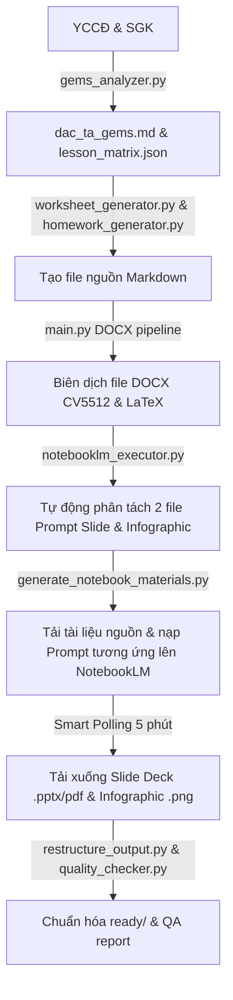

# GEMS Physics Material Generation Engine (GEMS v8.0)
========================================================================

Hệ thống tự động biên soạn và xuất bản học liệu Vật lý 12 chất lượng cao theo chuẩn giáo dục hiện đại và quy chuẩn thiết kế GEMS v8.0.

---

## 📁 Sơ đồ Cấu trúc Workspace Chuẩn hóa

Thư mục gốc của dự án được tổ chức một cách khoa học để phân tách rõ ràng giữa mã nguồn, tài liệu hướng dẫn, tài nguyên thô và thành phẩm đầu ra:

```text
soạn tài liệu/ (Thư mục gốc)
├── .agents/                    # Cấu hình Agent IDE & Luật thiết kế GEMS (AGENTS.md)
├── docs/                       # Tài liệu hướng dẫn & Thiết kế hệ thống
│   ├── diagrams/               # Sơ đồ thiết kế luồng xử lý (Mermaid .mmd)
│   └── reference/              # Kịch bản gốc môn học, tài liệu nâng cấp, quy trình chi tiết
├── engine/                     # Bộ nhân xử lý chính của GEMS Engine
│   ├── templates/              # Biểu mẫu và tệp định dạng Word (.docx)
│   └── backup/                 # Sao lưu mã nguồn cũ
├── output/                     # Thư mục thành phẩm học liệu (Không sử dụng thư mục con trung gian hermes)
│   ├── bai2_su_chuyen_the/     # Học liệu Bài 2
│   ├── bai3_noi_nang/          # Học liệu Bài 3
│   ├── bai4_nhiet_dung_rieng/  # Học liệu Bài 4 (Hoàn chỉnh 100%)
│   ├── bai5_nhiet_do_nhiet_ke/ # Học liệu Bài 5
│   ├── bai6_nhiet_nong_chay_rieng/ # Học liệu Bài 6
│   ├── bai7_nhiet_hoa_hoi_rieng/   # Học liệu Bài 7
│   └── generated_docs/         # Thư mục tổng hợp các bản phân phối trước đó
├── research/                   # Tài liệu phân tích sư phạm học thuật
├── scratch/                    # Kịch bản tự động hóa NotebookLM và các tệp công cụ nháp
├── skills/                     # Các skill hỗ trợ tự động hóa trong IDE (.md)
├── tai-lieu-goc/               # Dữ liệu văn bản yêu cầu cần đạt (YCCĐ) và tài liệu thô đầu vào
├── .gitignore                  # Cấu hình bỏ qua tệp của Git
├── changelog.md                # Nhật ký cập nhật phiên bản của dự án
└── readme.md                   # Tài liệu hướng dẫn hệ thống chính (Tệp này)
```

---

## ⚙️ Quy trình Vận hành Toàn phần (GEMS Pipeline)

Quy trình biên soạn học liệu bao gồm 6 giai đoạn khép kín, được tự động hóa tối đa:



### Chi tiết các Giai đoạn:
1. **Phân tích Sư phạm:** Trích xuất YCCĐ giáo dục phổ thông năm 2018 và phân chia thành các Đơn vị Kiến thức (ĐVKT).
2. **Sinh Học liệu MD:** Sinh tự động các tệp markdown nguồn như phiếu học tập, kế hoạch bài dạy, hướng dẫn slide và bài tập về nhà.
3. **Biên dịch DOCX (GEMS Formatting Engine):** Áp dụng luật GEMS v8.0 và SKILL định dạng giáo dục Việt Nam nâng cao:
   - **Căn lề động theo loại tài liệu:** Phiếu học tập (2cm đều bốn bên); KHBD (Trái 3cm, Phải 2cm, Trên/Dưới 2cm); Đề thi (Trái/Phải 2cm, Trên/Dưới 1.5cm).
   - **Giãn dòng & Thụt đầu dòng:** Thống nhất phông chữ Times New Roman, giãn dòng **1.3 lines** (Fixed 22pt), khoảng cách đoạn **6pt before/after**, và thụt dòng đầu **1.0 cm** cho văn bản thường.
   - **Bảng biểu nâng cao:** Header màu Navy (`#1E3A5F`), dòng dữ liệu xen kẽ Mint (`#E8F5E9`), độ rộng bảng luôn là 16.5cm. Dòng bảng tự động chống ngắt trang (`cantSplit`) và lặp lại header (`tblHeader`).
   - **Tối ưu hóa Đề thi:** Chống ngắt trang mồ côi (keepNext/keepLines) cho câu hỏi. Tự động xếp các phương án lựa chọn ABCD vào bảng không viền 2-4 cột linh hoạt theo độ dài phương án.
4. **NotebookLM Cloud Integration:** 
   - Tự động quét file Phiếu học tập để phân tích ĐVKT và file Hướng dẫn slide để bóc tách thông tin thiết kế đặc thù (giáo viên, phông chữ chủ đạo, trường phái thiết kế, quy tắc bắt buộc).
   - Tạo ra **hai file prompt chuyên biệt**: prompt slide (`_slide_prompt.md`) và prompt infographic (`_info_prompt.md`) nạp tương ứng khi gọi CLI tạo slides và infographic để loại bỏ sự nhầm lẫn giữa hai loại.
5. **Smart Polling & Auto-Download:** Tự động gửi yêu cầu thăm dò trạng thái lên Google Cloud mỗi **5 phút**, khi hoàn tất sẽ tự động tải các tệp PowerPoint (`.pptx`), Slide dạng `.pdf` và Infographic (`.png`) về thư mục bài học.
6. **Hậu kỳ & QA:** Sắp xếp cấu trúc cây thư mục sạch sẽ, tự động tạo tệp `metadata.json` làm mục lục tài nguyên và đánh giá chất lượng học liệu dựa trên 15 tiêu chí QA của GEMS.

---

## 🚀 Hướng dẫn Sử dụng Agent AI Soạn Học Liệu (GEMSAgent)

Để kích hoạt Tác tử AI tự động thực hiện trọn vẹn 6 giai đoạn (từ phân tích YCCĐ, xuất bản Word in ấn, nạp Cloud NotebookLM và tải về Slide/Infographic), bạn chỉ cần chạy duy nhất một lệnh:

### 1. Chạy Agent với Prompt yêu cầu
Mở Terminal và nhập lệnh cùng với bài học bạn muốn soạn:
```powershell
# Chạy Agent biên soạn cho Bài 1
python engine/gems_agent.py --prompt "soạn bài 1 Cấu trúc chất"

# Chạy Agent biên soạn cho Bài 4
python engine/gems_agent.py --prompt "tạo lại học liệu bài 4 nhiệt dung riêng"
```

### 2. Cách hoạt động tự trị của Agent:
- **Tự động nhận diện bài học:** Agent tự động phân tích ngôn ngữ tự nhiên trong prompt của bạn để so khớp với cơ sở dữ liệu bài học (`LESSON_MAP`).
- **Tự động tìm kiếm tài liệu nguồn:** Agent quét và đọc file yêu cầu cần đạt trong thư mục `tai-lieu-goc/` (ví dụ `yccd_bai1.txt`).
- **Tự động sinh cấu trúc và nội dung:** Gọi Gemini API Pro để thiết lập ma trận GEMS và sinh 3 tệp MD nguồn.
- **Tự động biên dịch Word cục bộ:** Gọi pipeline xuất bản Word với các tiêu chuẩn lề trang và giãn dòng v8.0.
- **Vòng lặp tự kiểm duyệt (Quality Feedback Loop):** Tự động phân tích chất lượng của các file Word đầu ra để phát hiện lỗi tràn trang hoặc sai sót khoa học và tự chỉnh sửa nội dung.
- **Tự động nạp Cloud & Smart Polling:** Tự động gọi CLI `nlm` để upload các file nguồn lên Google NotebookLM, ra lệnh sinh Slide và Infographic, chạy Smart Polling mỗi 5 phút kiểm tra trạng thái và tải về các file `.pptx`, `.pdf`, `.png` thành phẩm khi sẵn sàng.

---

## 🎨 Quy định Việt hóa nhãn NotebookLM (Bắt buộc)
Các prompt chỉ chỉ thị gửi lên Cloud yêu cầu Việt hóa 100% các phần đầu việc của GEMS:
* **Assertion Reasoning** $\rightarrow$ **Nhận định & Lý do**
* **Matching Matrix** $\rightarrow$ **Ghép nối đa biến**
* **Bug Buster** $\rightarrow$ **Tìm và sửa lỗi vật lý**
* **Algorithmic Ordering** $\rightarrow$ **Sắp xếp tiến trình**
* **Visual Cloze Test** $\rightarrow$ **Điền khuyết trực quan**

---

## 📊 Nhật ký Thay đổi Phiên bản
Xem nhật ký cập nhật chi tiết tại [changelog.md](changelog.md).
Sơ đồ Mermaid chi tiết có thể được tham chiếu tại [gems_agent_pipeline.mmd](docs/diagrams/gems_agent_pipeline.mmd).