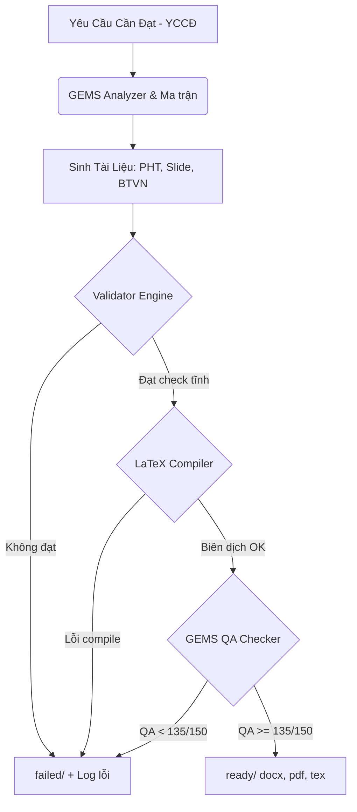

# Kế Hoạch Nâng Cấp Toàn Diện Hệ Thống GEMS Vật Lý 12 (v8.5)

Hệ thống AI tạo tài liệu GEMS Vật Lý 12 hiện tại đã sinh được nội dung chất lượng, tuy nhiên còn gặp 3 lỗi nghiêm trọng (P0) khiến các tài liệu đầu ra không thể xuất bản trực tiếp: biên dịch LaTeX bị lỗi cấu trúc (conflict gói lệnh), thiếu hoặc sai lệch nhiệm vụ giữa các file (Cross-file validation), và tồn tại placeholder/TODO chưa điền. 

Kế hoạch này đề xuất nâng cấp hệ thống GEMS lên phiên bản v8.5 bổ sung các lớp kiểm định tự động (Validation & QA Gates) và chuẩn hóa cấu trúc mẫu.

## Đánh Giá & Điểm Đổi Mới Quan Trọng

> [!IMPORTANT]
> **Điểm cốt lõi:** Thay vì cố gắng sinh lại (regenerate) toàn bộ tài liệu bằng AI mỗi khi có lỗi (gây tốn kém token và không đảm bảo hết lỗi), chúng ta sẽ xây dựng một **Validation Layer bằng Python** để kiểm tra tĩnh, biên dịch thử nghiệm, lọc placeholder, và chấm điểm QA tự động. Chỉ những tệp đạt chất lượng tuyệt đối mới được chuyển vào thư mục `ready/`.

> [!NOTE]
> **Định vị lại Nhiệm vụ 9:** Đổi tên nhiệm vụ từ "Fact Check Influencer" thành "Error Analysis — Phân Tích Sai Số Thực Nghiệm" nhằm phù hợp hơn với giáo trình GDPT 2018 và nâng cao tính giáo dục khoa học.

---

## Các Thay Đổi Đề Xuất (Proposed Changes)

Hệ thống sẽ được nâng cấp qua 3 Sprint với các cấu phần như sau:

---

### 1. Hệ Thống Core Engine & Validation

#### [NEW] [gems_task_registry.json](file:///c:/Users/Admin/.antigravity-ide/so%E1%BA%A1n%20t%C3%A0i%20li%E1%BB%87u/engine/gems_task_registry.json)
File định nghĩa tập trung 12 nhiệm vụ chuẩn hóa của GEMS để làm "Single Source of Truth".

#### [NEW] [validator.py](file:///c:/Users/Admin/.antigravity-ide/so%E1%BA%A1n%20t%C3%A0i%20li%E1%BB%87u/engine/validator.py)
*   **Chức năng:** So khớp tính nhất quán (cross-file validation) giữa:
    *   Tệp đặc tả (`dac_ta_gems.md`)
    *   Phiếu học tập (`phieu_hoc_tap.md`)
    *   Hướng dẫn Slide (`huong_dan_slide.md`)
    *   Bài tập về nhà (`bai_tap_ve_nha.tex`)
*   **Chi tiết kiểm tra:** Đảm bảo tất cả nhiệm vụ khai báo ở đặc tả phải xuất hiện đầy đủ, đúng thứ tự, đúng phân loại theo `gems_task_registry.json`.

---

### 2. Chuẩn Hóa LaTeX & Trình Biên Dịch Tự Động

#### [NEW] [preamble-xelatex.tex](file:///c:/Users/Admin/.antigravity-ide/so%E1%BA%A1n%20t%C3%A0i%20li%E1%BB%87u/engine/templates/preamble-xelatex.tex)
*   **Chức năng:** Định nghĩa gói lệnh chuẩn cho XeLaTeX dùng `fontspec` để xử lý tiếng Việt font Times New Roman, loại bỏ hoàn toàn các lỗi conflict encoding.
*   **Thư viện hỗ trợ:** `pgfplots`, `tikz`, `amsmath`, `amssymb`.

#### [NEW] [homework-template.tex](file:///c:/Users/Admin/.antigravity-ide/so%E1%BA%A1n%20t%C3%A0i%20li%E1%BB%87u/engine/templates/homework-template.tex)
*   **Chức năng:** Khung bài tập về nhà định dạng chuẩn 2025 của Bộ GD&ĐT:
    *   **Phần I:** 18 câu trắc nghiệm nhiều lựa chọn.
    *   **Phần II:** 4 câu trắc nghiệm Đúng/Sai (mỗi câu 4 ý a,b,c,d).
    *   **Phần III:** 6 câu trắc nghiệm trả lời ngắn (điền số).

#### [NEW] [latex_compiler.py](file:///c:/Users/Admin/.antigravity-ide/so%E1%BA%A1n%20t%C3%A0i%20li%E1%BB%87u/engine/latex_compiler.py)
*   **Chức năng:** Tự động gọi trình biên dịch XeLaTeX của hệ điều hành để build thử tệp `.tex`. 
*   **Ngăn chặn:** Nếu có lỗi cú pháp hoặc thiếu gói lệnh → Ghi log lỗi vào file chẩn đoán và chặn không cho xuất bản sang `ready/`.

---

### 3. Bộ Lọc Chất Lượng & Dữ Liệu Sư Phạm

#### [NEW] [placeholder_check.py](file:///c:/Users/Admin/.antigravity-ide/so%E1%BA%A1n%20t%C3%A0i%20li%E1%BB%87u/engine/placeholder_check.py)
*   **Chức năng:** Sử dụng Regex quét toàn bộ các file markdown và LaTeX đầu ra.
*   **Phát hiện:** Tìm các chuỗi `TODO`, `placeholder`, dấu ba chấm `...` (không phải dấu chấm lửng toán học), hoặc các câu mô tả chung chung như `(Các câu hỏi từ...)`. Block ngay lập tức nếu phát hiện.

#### [NEW] [ref_data.yaml](file:///c:/Users/Admin/.antigravity-ide/so%E1%BA%A1n%20t%C3%A0i%20li%E1%BB%87u/engine/ref_data.yaml)
*   **Chức năng:** Lưu trữ các hằng số vật lý thực tế chuẩn xác của chương trình lớp 12 (nhiệt dung riêng, nhiệt nóng chảy riêng, nhiệt hóa hơi riêng của nước, dầu, đồng, sắt...).
*   **Ứng dụng:** Nhúng cơ sở dữ liệu này vào prompt sinh đề của AI để thực hiện đối chiếu thực tế (Fact-check), tránh AI sinh số liệu phi vật lý.

---

### 4. Quy Trình Phân Phối (Conveyor) & QA Checker

#### [NEW] [gems_qa_checker.py](file:///c:/Users/Admin/.antigravity-ide/so%E1%BA%A1n%20t%C3%A0i%20li%E1%BB%87u/engine/gems_qa_checker.py)
*   **Chức năng:** Tự động hóa quá trình chấm điểm 15 tiêu chí QA (Worksheet: 60đ, Slide: 50đ, Homework: 40đ).
*   **Đầu ra:** Bản báo cáo `qa-report.md` chi tiết.
*   **Cơ chế Gatekeeper:** Đạt ≥ 135/150 điểm mới cho phép xuất bản.

#### [NEW] [gems_conveyor.py](file:///c:/Users/Admin/.antigravity-ide/so%E1%BA%A1n%20t%C3%A0i%20li%E1%BB%87u/engine/gems_conveyor.py)
*   **Chức năng:** Điều phối di chuyển tập tin tự động:
    *   Sản phẩm mới tạo sẽ nằm ở `staging/`.
    *   Nếu pass Validator + LaTeX Compiler + QA Gate → Move vào `ready/`.
    *   Nếu fail bất kỳ bước nào → Move vào `failed/` cùng với log chi tiết nguyên nhân.

---

## Kế Hoạch Triển Khai (Sprint Roadmap)

### 🚀 Sprint 1: Nền tảng Biên dịch & Validate Chéo (Ưu tiên P0)
*   Tạo thư mục `engine/templates/` và viết các file `preamble-xelatex.tex`, `homework-template.tex`.
*   Viết script `engine/latex_compiler.py` tích hợp XeLaTeX CLI.
*   Viết `engine/validator.py` kiểm tra số lượng và thứ tự nhiệm vụ chéo giữa các file nguồn.
*   Viết `engine/placeholder_check.py` để quét và chặn các file chứa placeholder/TODO.

### 📅 Sprint 2: Dữ Liệu Thực Tế & Phân Phối Conveyor (Ưu tiên P1)
*   Thiết lập cơ sở dữ liệu vật lý chuẩn `engine/ref_data.yaml` và cập nhật prompt hệ thống của các Agent tạo tài liệu.
*   Xây dựng hệ thống phân phối tệp `engine/gems_conveyor.py` tạo các thư mục `staging/`, `ready/`, `failed/` cho mỗi bài học.
*   Cập nhật kịch bản Prompt cho Nhiệm vụ 9 (Error Analysis — Phân Tích Sai Số).

### 📈 Sprint 3: Đánh Giá Chất Lượng Tự Động & Tối Ưu Hóa (Ưu tiên P1/P2)
*   Hoàn thiện `engine/gems_qa_checker.py` chấm điểm tự động 15 tiêu chí chất lượng và xuất file `qa-report.md`.
*   Nâng cấp cơ chế sinh gia tốc (Incremental generation) tránh tạo lại toàn bộ file nếu chỉ có 1 file bị lỗi.
*   Tạo file `engine/gems_task_registry.json`.

---

## Kế Hoạch Xác Minh (Verification Plan)

### Thử nghiệm tự động
1.  **XeLaTeX Compilation Check:** Chạy lệnh thử nghiệm biên dịch với tệp chứa lỗi LaTeX cố tình tạo ra để đảm bảo `latex_compiler.py` phát hiện lỗi chính xác.
2.  **Validator & Placeholder Regex Test:** Chạy test suite nạp các file markdown có chứa placeholder hoặc thiếu nhiệm vụ để xác định hệ thống có chặn đúng kỳ vọng hay không.
3.  **Conveyor Routing Test:** Kiểm tra các tệp pass/fail được di chuyển chính xác vào các thư mục `ready/` và `failed/`.

### Thử nghiệm thực tế
*   Biên dịch và chạy thử hệ thống nâng cấp trực tiếp trên tài liệu **Bài 4 — Nhiệt dung riêng** hoặc **Bài 7 — Nhiệt hóa hơi riêng** đang có sẵn để kiểm tra báo cáo đầu ra.
