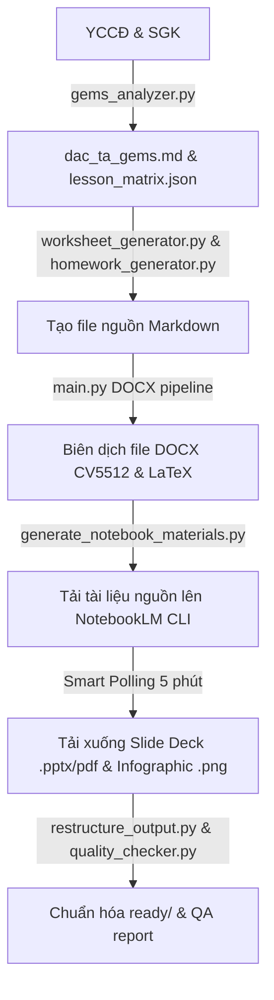

# GEMS Physics Material Generation Engine (GEMS v8.0)
========================================================================

Hệ thống tự động biên soạn và xuất bản học liệu Vật lý 12 chất lượng cao theo chuẩn giáo dục hiện đại và quy chuẩn thiết kế GEMS v8.0.

---

## 📁 Sơ đồ Cấu trúc Workspace Chuẩn hóa

Thư mục gốc của dự án được tổ chức một cách khoa học để phân tách rõ ràng giữa mã nguồn, tài liệu hướng dẫn, tài nguyên thô và thành phẩm đầu ra:

```text
soạn tài liệu/ (Thư mục gốc)
├── .agents/                    # Cấu hình Agent IDE & Luật thiết kế GEMS (AGENTS.md)
├── docs/                       # Tài liệu hướng dẫn & Thiết kế hệ thống
│   ├── diagrams/               # Sơ đồ thiết kế luồng xử lý (Mermaid .mmd)
│   └── reference/              # Kịch bản gốc môn học, tài liệu nâng cấp, quy trình chi tiết
├── engine/                     # Bộ nhân xử lý chính của GEMS Engine
│   ├── templates/              # Biểu mẫu và tệp định dạng Word (.docx)
│   └── backup/                 # Sao lưu mã nguồn cũ
├── output/                     # Thư mục thành phẩm học liệu (Không sử dụng thư mục con trung gian hermes)
│   ├── bai2_su_chuyen_the/     # Học liệu Bài 2
│   ├── bai3_noi_nang/          # Học liệu Bài 3
│   ├── bai4_nhiet_dung_rieng/  # Học liệu Bài 4 (Hoàn chỉnh 100%)
│   ├── bai5_nhiet_do_nhiet_ke/ # Học liệu Bài 5
│   ├── bai6_nhiet_nong_chay_rieng/ # Học liệu Bài 6
│   ├── bai7_nhiet_hoa_hoi_rieng/   # Học liệu Bài 7
│   └── generated_docs/         # Thư mục tổng hợp các bản phân phối trước đó
├── research/                   # Tài liệu phân tích sư phạm học thuật
├── scratch/                    # Kịch bản tự động hóa NotebookLM và các tệp công cụ nháp
├── skills/                     # Các skill hỗ trợ tự động hóa trong IDE (.md)
├── tai-lieu-goc/               # Dữ liệu văn bản yêu cầu cần đạt (YCCĐ) và tài liệu thô đầu vào
├── .gitignore                  # Cấu hình bỏ qua tệp của Git
├── changelog.md                # Nhật ký cập nhật phiên bản của dự án
└── readme.md                   # Tài liệu hướng dẫn hệ thống chính (Tệp này)
```

---

## ⚙️ Quy trình Vận hành Toàn phần (GEMS Pipeline)

Quy trình biên soạn học liệu bao gồm 6 giai đoạn khép kín, được tự động hóa tối đa:



### Chi tiết các Giai đoạn:
1. **Phân tích Sư phạm:** Trích xuất YCCĐ giáo dục phổ thông năm 2018 và phân chia thành các Đơn vị Kiến thức (ĐVKT).
2. **Sinh Học liệu MD:** Sinh tự động các tệp markdown nguồn như phiếu học tập, kế hoạch bài dạy, hướng dẫn slide và bài tập về nhà.
3. **Biên dịch DOCX:** Áp dụng luật GEMS v8.0 để chuyển đổi Markdown sang Word (.docx) chuyên nghiệp:
   - **Font chữ:** Times New Roman.
   - **Căn lề A4:** Trái 3.0 cm, Phải 1.5 cm, Trên/Dưới 2.0 cm.
   - **Bảng biểu:** Header màu Navy (`#1E3A5F`), dòng dữ liệu xen kẽ Trắng / Mint (`#E8F5E9`), độ rộng bảng luôn là 16.5cm.
   - **Kế hoạch bài dạy (KHBD):** Định dạng 2 cột theo chuẩn công văn 5512, có bảng chữ ký xác nhận ở cuối.
4. **NotebookLM Cloud Integration:** Tự động tạo Notebook, upload tài liệu, và ra lệnh sinh Slide và Infographic dạng dọc bằng tệp prompt chỉ dẫn tập trung `notebooklm_prompt.md`.
5. **Smart Polling & Auto-Download:** Tự động gửi yêu cầu thăm dò trạng thái lên Google Cloud mỗi **5 phút**, khi hoàn tất sẽ tự động tải các tệp PowerPoint (`.pptx`), Slide dạng `.pdf` và Infographic (`.png`) về thư mục bài học.
6. **Hậu kỳ & QA:** Sắp xếp cấu trúc cây thư mục sạch sẽ, tự động tạo tệp `metadata.json` làm mục lục tài nguyên và đánh giá chất lượng học liệu dựa trên 15 tiêu chí QA của GEMS.

---

## 🚀 Hướng dẫn Sử dụng Hệ thống

### Bước 1: Sinh nội dung học liệu & Biên dịch DOCX cục bộ
Chạy lệnh orchestrator chính của GEMS để sinh phiếu học tập, giáo án và bài tập về nhà từ file YCCĐ thô:
```powershell
# Chạy toàn bộ pipeline sinh MD và biên dịch DOCX
python engine/main.py --yccd tai-lieu-goc/yccd_bai4.txt -o output/bai4_nhiet_dung_rieng -l "Bài 4 - Nhiệt dung riêng"

# Hoặc chỉ biên dịch lại file DOCX từ MD có sẵn
python engine/main.py --docx-only -o output/bai4_nhiet_dung_rieng -l "Bài 4 - Nhiệt dung riêng"
```

### Bước 2: Tự động hóa NotebookLM sinh Slide & Infographic
1. Đảm bảo bạn đã cài đặt công cụ `nlm` và đăng nhập thành công:
   ```powershell
   nlm login
   ```
2. Chạy kịch bản tự động hóa trung tâm (hỗ trợ Smart Polling 5 phút):
   ```powershell
   python scratch/generate_notebook_materials.py --lesson "Bài 4"
   ```
   Kịch bản sẽ tự động quét danh sách Notebook hiện tại, tái sử dụng Notebook Bài 4 có sẵn, tải lên các file nguồn, kích hoạt tạo Slide & Infographic, đợi Cloud xử lý và tự động tải về thư mục `output/bai4_nhiet_dung_rieng/ready/`.

---

## 🎨 Quy định Việt hóa nhãn NotebookLM (Bắt buộc)
Các prompt chỉ chỉ thị gửi lên Cloud yêu cầu Việt hóa 100% các phần đầu việc của GEMS:
* **Assertion Reasoning** $\rightarrow$ **Nhận định & Lý do**
* **Matching Matrix** $\rightarrow$ **Ghép nối đa biến**
* **Bug Buster** $\rightarrow$ **Tìm và sửa lỗi vật lý**
* **Algorithmic Ordering** $\rightarrow$ **Sắp xếp tiến trình**
* **Visual Cloze Test** $\rightarrow$ **Điền khuyết trực quan**

---

## 📊 Nhật ký Thay đổi Phiên bản
Xem nhật ký cập nhật chi tiết tại [changelog.md](file:///c:/Users/Admin/.antigravity-ide/so%E1%BA%A1n%20t%C3%A0i%20li%E1%BB%87u/changelog.md).
Sơ đồ Mermaid chi tiết có thể được tham chiếu tại [gems_agent_pipeline.mmd](file:///c:/Users/Admin/.antigravity-ide/so%E1%BA%A1n%20t%C3%A0i%20li%E1%BB%87u/docs/diagrams/gems_agent_pipeline.mmd).