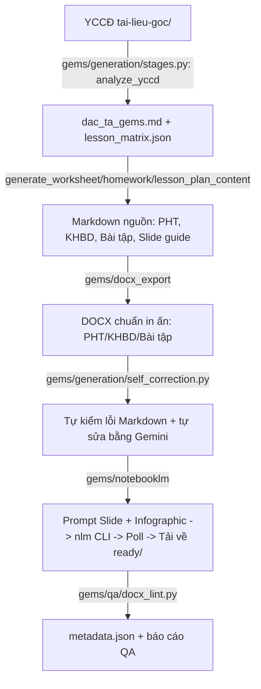

# GEMS — Hệ thống Tự động Biên soạn Học liệu Vật lý 12 (v9.0)

========================================================================

Agent tự động biên soạn và xuất bản học liệu Vật lý 12 chất lượng cao (Phiếu
học tập, Kế hoạch bài dạy chuẩn CV5512, Bài tập về nhà, Slide bài giảng và
Infographic) theo chương trình GDPT 2018, dùng Gemini API + Google NotebookLM.

Kiến trúc v9.0 (7/2026) là bản viết lại toàn bộ, hợp nhất 2 pipeline từng
tách rời và không tương thích nhau, xoá code chết, và dọn sạch 2 cây thư mục
dự án từng bị nhân đôi. Chi tiết lý do xem [changelog.md](changelog.md).

---

## 📁 Cấu trúc thư mục

```text
soạn tài liệu/ (thư mục gốc)
├── gems/                        # Package chính — TOÀN BỘ logic thật nằm ở đây
│   ├── cli.py / __main__.py     # Điểm vào: python -m gems <lệnh> --lesson baiN
│   ├── config/                  # curriculum.yaml (danh mục bài) + identity.yaml (tên GV/brand)
│   ├── models/                  # Pydantic schema (khai đúng 1 lần/schema)
│   ├── prompts/                 # Prompt hệ thống gửi Gemini
│   ├── generation/               # Gọi Gemini + ghi Markdown + tự sửa lỗi
│   ├── docx_export/              # Markdown -> DOCX (layout/palette/styles/exporter)
│   ├── qa/                       # Lint Markdown (regex) + lint DOCX (cấu trúc)
│   ├── notebooklm/                # nlm CLI wrapper + tạo prompt + poll/tải Slide-Infographic
│   ├── pipeline/                  # RunReport + GEMSPipeline (điều phối 1 pipeline duy nhất)
│   └── offline/                    # Fixture mẫu — chạy thử không cần API/mạng
├── tests/                        # pytest cho toàn bộ gems/ (fixture markdown thật trong tests/fixtures/)
├── tai-lieu-goc/                 # YCCĐ, SGK, khung chương trình GDPT 2018 (tài liệu nguồn)
├── output/                       # output/<slug>/{md,ready,notebooklm}/ + metadata.json mỗi bài
├── docs/                         # Sơ đồ & tài liệu tham khảo bổ sung
├── skills/                       # Tri thức sư phạm (gems_physics_skill.md) + kỹ thuật docx (docx_skill.md)
├── .agents/agents.md             # Quy chuẩn định dạng chính thức — nguồn thật duy nhất
├── .brain/                       # Bộ nhớ phiên làm việc AI (handover, session log)
├── pyproject.toml / requirements.txt
└── changelog.md
```

---

## ⚙️ Quy trình vận hành (GEMS Pipeline)



## 🚀 Cách chạy

```powershell
# Cài đặt (1 lần)
pip install -r requirements.txt
# hoặc: pip install -e .

# Sinh học liệu bằng Gemini API (cần GEMINI_API_KEY trong .env)
python -m gems generate --lesson bai4
python -m gems generate --prompt "soạn bài 4 nhiệt dung riêng"

# Tạo Slide + Infographic qua Google NotebookLM (cần `nlm login` trước)
python -m gems notebooklm --lesson bai4

# Cả 2 bước trên liên tiếp
python -m gems full --lesson bai4

# Chạy thử toàn bộ pipeline bằng dữ liệu mẫu — KHÔNG cần API key/mạng
python -m gems offline --lesson bai4

# Kiểm định chất lượng DOCX đã có sẵn trong ready/
python -m gems lint --lesson bai4

# Xem danh mục bài học hiện có
python -m gems list-lessons
```

Thêm bài học mới: chỉ cần thêm 1 mục vào `gems/config/curriculum.yaml`, không
cần sửa code (trước đây `LESSON_MAP` bị khai trùng ở 2 file khác nhau).

### Không dùng GEMINI_API_KEY — để AI agent (Claude/Antigravity) tự soạn nội dung

Nếu không muốn cấu hình `GEMINI_API_KEY`, dùng `compose` thay cho `generate`:
AI agent đang trò chuyện (chạy trong Antigravity IDE) tự soạn nội dung bằng
suy luận trực tiếp — không gọi API ngoài nào — rồi ghi ra 4 file JSON khớp
đúng schema Pydantic (`gems/models/*.py`) vào `output/<slug>/authored/`:

```
output/<slug>/authored/<slug>_architect.json     # khớp gems.models.architect.GEMSArchitect
output/<slug>/authored/<slug>_worksheet.json     # khớp gems.models.worksheet.LessonWorksheet
output/<slug>/authored/<slug>_homework.json      # khớp gems.models.homework.HomeworkContent
output/<slug>/authored/<slug>_lesson_plan.json   # khớp gems.models.lesson_plan.LessonPlanContent
```

Sau đó chạy:

```powershell
python -m gems compose --lesson bai4                        # Markdown + DOCX từ JSON đã soạn
python -m gems full --lesson bai4 --content-dir output/bai4_nhiet_dung_rieng/authored  # + NotebookLM
```

`compose` dùng lại đúng bộ `gems/docx_export` như `generate`/`offline` — chỉ
khác nguồn nội dung, không có đường xử lý DOCX riêng nào khác.

## 🎨 Quy định thương hiệu & Việt hóa

Tên giáo viên, phông chữ chủ đạo và nhãn phiên bản GEMS đọc từ
`gems/config/identity.yaml` — sửa 1 chỗ, áp dụng toàn hệ thống.

Nhãn tiếng Anh của GEMS luôn được dịch khi gửi lên NotebookLM:
* **Assertion Reasoning** → **Nhận định & Lý do**
* **Matching Matrix** → **Ghép nối đa biến**
* **Bug Buster** → **Tìm và sửa lỗi vật lý**
* **Algorithmic Ordering** → **Sắp xếp tiến trình**
* **Visual Cloze Test** → **Điền khuyết trực quan**

## 🧪 Kiểm thử

```powershell
python -m pytest tests/ -q
```

## 📊 Nhật ký thay đổi

Xem [changelog.md](changelog.md).
