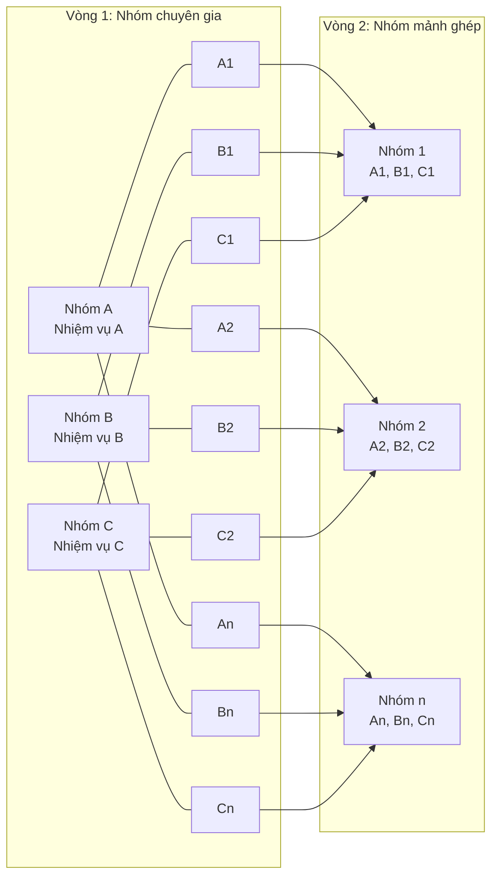
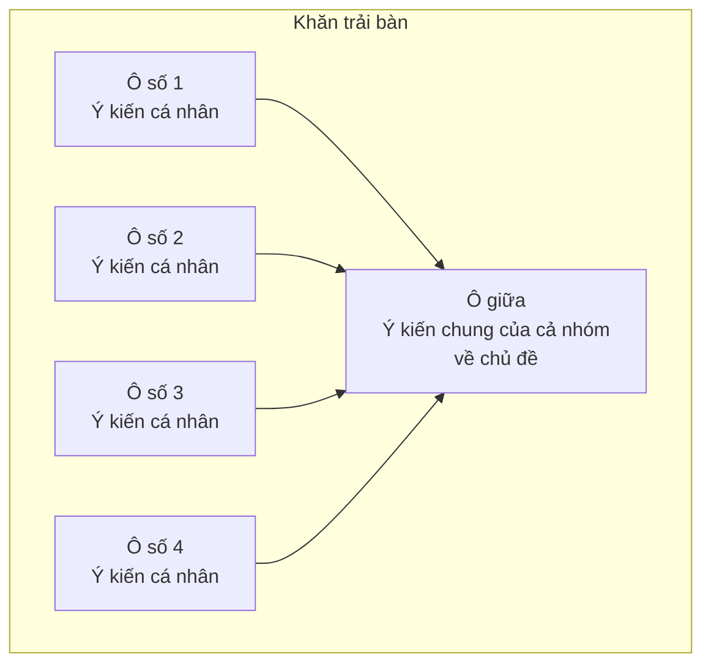
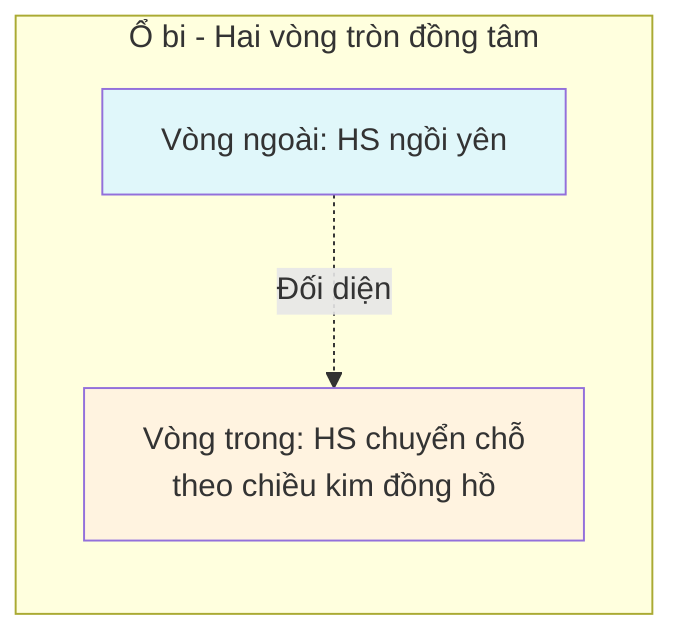
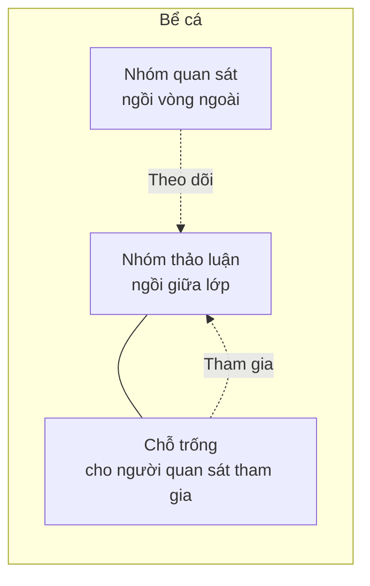
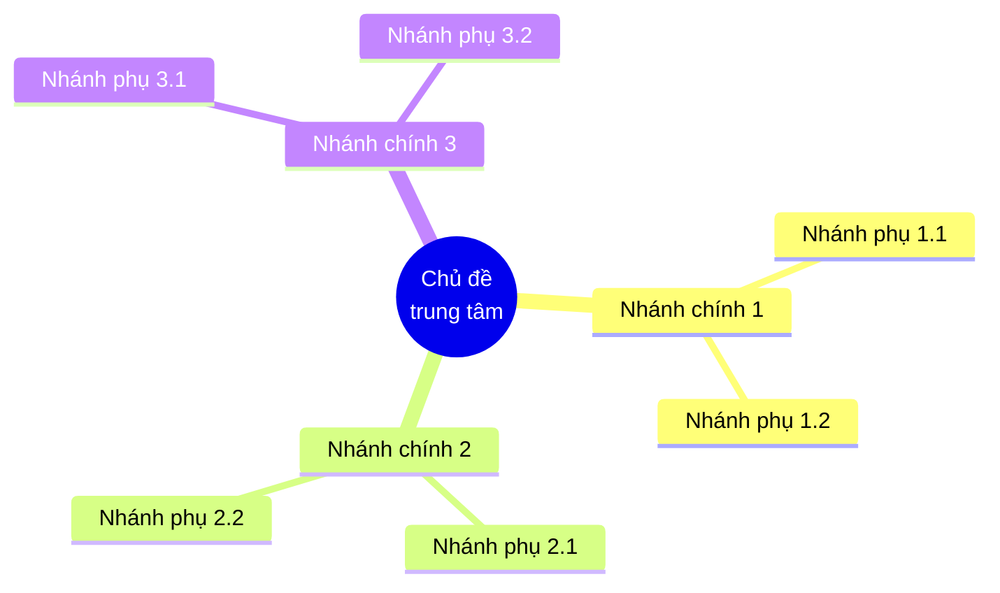
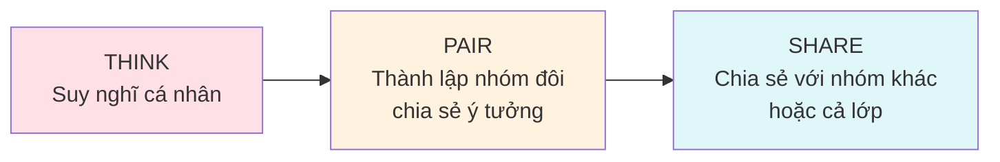
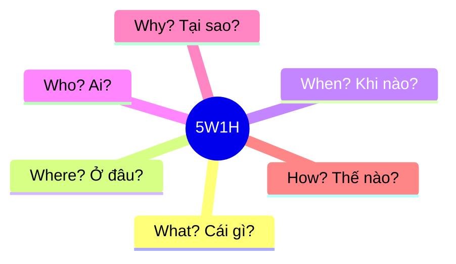
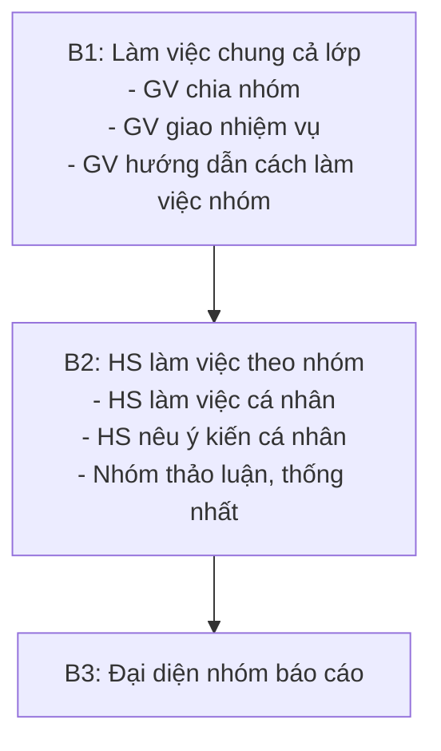
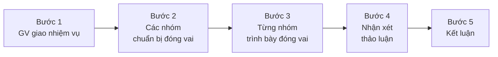

# 17 KĨ THUẬT DẠY HỌC TÍCH CỰC

## DÀNH CHO CÁC THẦY CÔ

Có rất nhiều kĩ thuật dạy học tích cực mà những nhà nghiên cứu giáo dục đã đưa ra nhằm dạy học sinh không chỉ tiếp thu kiến thức tốt mà còn phát triển năng lực. Điều quan trọng là giáo viên linh hoạt tuỳ theo bài học để chọn kĩ thuật phù hợp.

Kĩ thuật dạy học là những biện pháp, cách thức hành động của của giáo viên và học sinh trong các tình huống hành động nhỏ nhằm thực hiện và điều khiển quá trình dạy học. Các kĩ thuật dạy học là những đơn vị nhỏ nhất của phương pháp dạy học.

---

## 1. Kĩ thuật "Các mảnh ghép"

### Thế nào là kĩ thuật "Các mảnh ghép"?

Là hình thức học tập hợp tác kết hợp giữa cá nhân, nhóm và liên kết giữa các nhóm nhằm:

- Giải quyết một nhiệm vụ phức hợp (có nhiều chủ đề)
- Kích thích sự tham gia tích cực của HS
- Nâng cao vai trò của cá nhân trong quá trình hợp tác (Không chỉ hoàn thành nhiệm vụ ở Vòng 1 mà còn phải truyền đạt lại kết quả vòng 1 và hoàn thành nhiệm vụ ở Vòng 2).

### Cách tiến hành kĩ thuật "Các mảnh ghép"

#### Vòng 1: Nhóm chuyên gia

- Hoạt động theo nhóm 3 đến 8 người [số nhóm được chia = số chủ đề × n (n = 1, 2, …)]
- Mỗi nhóm được giao một nhiệm vụ [Ví dụ: nhóm 1: nhiệm vụ A; nhóm 2: nhiệm vụ B, nhóm 3: nhiệm vụ C, … (có thể có nhóm cùng nhiệm vụ)]
- Mỗi cá nhân làm việc độc lập trong khoảng vài phút, suy nghĩ về câu hỏi, chủ đề và ghi lại những ý kiến của mình
- Khi thảo luận nhóm phải đảm bảo mỗi thành viên trong từng nhóm đều trả lời được tất cả các câu hỏi trong nhiệm vụ được giao và trở thành "chuyên gia" của lĩnh vực đã tìm hiểu và có khả năng trình bày lại câu trả lời của nhóm ở vòng 2.

**Sơ đồ minh họa kĩ thuật "Các mảnh ghép":**

*Sơ đồ thể hiện hai vòng của kĩ thuật: Vòng 1 (chuyên gia) gồm các nhóm A, B, C với các thành viên A1, A2, …, An; B1, B2, …, Bn; C1, C2, …, Cn. Vòng 2 (mảnh ghép) là kết quả ghép các thành viên từ các nhóm chuyên gia khác nhau vào cùng một nhóm mới (A1, B1, C1; A2, B2, C2; …; An, Bn, Cn).*

<!-- Mermaid diagram mô tả cấu trúc logic của kĩ thuật "Các mảnh ghép" -->

#### Vòng 2: Nhóm các mảnh ghép

- Hình thành nhóm 3 đến 6 người mới (1 – 2 người từ nhóm 1, 1 – 2 người từ nhóm 2, 1 – 2 người từ nhóm 3…)
- Các câu trả lời và thông tin của vòng 1 được các thành viên trong nhóm mới chia sẻ đầy đủ với nhau
- Khi mọi thành viên trong nhóm mới đều hiểu được tất cả nội dung ở vòng 1 thì nhiệm vụ mới sẽ được giao cho các nhóm để giải quyết
- Các nhóm mới thực hiện nhiệm vụ, trình bày và chia sẻ kết quả

### Một vài ý kiến cá nhân với kĩ thuật "Các mảnh ghép"

- Kĩ thuật này áp dụng cho hoạt động nhóm với nhiều chủ đề nhỏ trong tiết học, học sinh được chia nhóm ở vòng 1 (chuyên gia) cùng nghiên cứu một chủ đề.
- Phiếu học tập mỗi chủ đề nên sử dụng trên giấy cùng màu có đánh số 1, 2, …, n (nếu không có giấy màu có thể đánh thêm kí tự A, B, C, … . Ví dụ A1, A2, … An, B1, B2, …, Bn, C1, C2, …, Cn).
- Sau khi các nhóm ở vòng 1 hoàn tất công việc giáo viên hình thành nhóm mới (mảnh ghép) theo số đã đánh, có thể có nhiều số trong 1 nhóm mới. Bước này phải tiến hành một cách cẩn thận tránh làm cho học sinh ghép nhầm nhóm.
- Trong điều kiện phòng học hiện nay việc ghép nhóm vòng 2 sẽ gây mất trật tự.

### Ví dụ: Bài học tiếng Việt

**Vòng 1**

| Chủ đề | Nội dung | Màu đánh dấu |
|--------|----------|--------------|
| Chủ đề A | Thế nào là câu đơn? Nêu ví dụ minh họa và phân tích | Màu đỏ |
| Chủ đề B | Thế nào là câu ghép? Nêu ví dụ minh họa và phân tích | Màu xanh |
| Chủ đề C | Thế nào là câu phức? Nêu ví dụ minh họa và phân tích | Màu vàng |

Lớp có 45 học sinh, có 12 bàn học.

Giáo viên có thể chia thành 6 nhóm: mỗi nhóm gồm học sinh 2 bàn ghép lại (mỗi nhóm có 7 hoặc 8 học sinh). Giao nhiệm vụ: nhóm 1, 2 nhận chủ đề A, nhóm 3, 4 nhận chủ đề B, nhóm 5, 6 nhận chủ đề C.

Phát phiếu học tập cho học sinh. Trên phiếu học tập theo màu có đánh số từ 1 đến 15. Thông báo cho học sinh thời gian làm việc cá nhân và theo nhóm.

**Vòng 2**

Giáo viên thông báo chia thành 12 nhóm mới: mỗi nhóm 1 bàn (mỗi nhóm có từ 3 đến 6 học sinh):

| Nhóm mới | Số phiếu học tập của các thành viên |
|----------|--------------------------------------|
| Nhóm 1 | 1, 2 |
| Nhóm 2 | 3, 4 |
| Nhóm 3 | 5 |
| Nhóm 4 | 6 |
| … | … |
| Nhóm 12 | 14, 15 |

Giáo viên thông báo thời gian làm việc nhóm mới.

Các chuyên gia sẽ trình bày ý kiến của nhóm mình ở vòng 1.

Giao nhiệm vụ mới: **Câu đơn, câu phức và câu ghép khác nhau ở điểm nào? Phân tích ví dụ minh hoạ.**

---

## 2. Kĩ thuật "Khăn trải bàn"

### Thế nào là kĩ thuật "Khăn trải bàn"?

Là hình thức tổ chức hoạt động mang tính hợp tác kết hợp giữa hoạt động cá nhân và hoạt động nhóm nhằm:

- Kích thích, thúc đẩy sự tham gia tích cực
- Tăng cường tính độc lập, trách nhiệm của cá nhân HS
- Phát triển mô hình có sự tương tác giữa HS với HS

### Cách tiến hành kĩ thuật "Khăn trải bàn"

- Hoạt động theo nhóm (4 người / nhóm) (có thể nhiều người hơn)
- Mỗi người ngồi vào vị trí như hình vẽ minh họa
- Tập trung vào câu hỏi (hoặc chủ đề, …)
- Viết vào ô mang số của bạn câu trả lời hoặc ý kiến của bạn (về chủ đề…). Mỗi cá nhân làm việc độc lập trong khoảng vài phút
- Kết thúc thời gian làm việc cá nhân, các thành viên chia sẻ, thảo luận và thống nhất các câu trả lời
- Viết những ý kiến chung của cả nhóm vào ô giữa tấm khăn trải bàn (giấy A0)

**Sơ đồ minh họa kĩ thuật "Khăn trải bàn":**

*Bố cục hình vuông chia làm 4 ô ở bốn góc (đánh số 1, 2, 3, 4) cho mỗi cá nhân viết ý kiến của mình, và một ô ở giữa ghi "Ý kiến chung của cả nhóm về chủ đề" để tổng hợp ý kiến sau khi thảo luận.*

<!-- Mermaid diagram mô tả cấu trúc kĩ thuật "Khăn trải bàn" -->

### Một vài ý kiến cá nhân với kĩ thuật "Khăn trải bàn"

- Kĩ thuật này giúp cho hoạt động nhóm có hiệu quả hơn, mỗi học sinh đều phải đưa ra ý kiến của mình về chủ đề đang thảo luận, không ỷ lại vào các bạn học khá, giỏi.
- Kĩ thuật này áp dụng cho hoạt động nhóm với một chủ đề nhỏ trong tiết học, toàn thể học sinh cùng nghiên cứu một chủ đề.
- Sau khi các nhóm hoàn tất công việc giáo viên có thể gắn các mẫu giấy "khăn trải bàn" lên bảng để cả lớp cùng nhận xét. Có thể dùng giấy nhỏ hơn, dùng máy chiếu phóng lớn.
- Có thể thay số bằng tên của học sinh để sau đó giáo viên có thể đánh giá được khả năng nhận thức của từng học sinh về chủ đề được nêu.

---

## 3. Kĩ thuật "Động não"

### Thế nào là kĩ thuật "Động não"?

Động não (công não) là một kỹ thuật nhằm huy động những tư tưởng mới mẻ, độc đáo về một chủ đề của các thành viên trong thảo luận. Các thành viên được cổ vũ tham gia một cách tích cực, không hạn chế các ý tưởng (nhằm tạo ra "cơn lốc" các ý tưởng). Kỹ thuật động não do Alex Osborn (Mỹ) phát triển, dựa trên một kỹ thuật truyền thống từ Ấn độ.

### Quy tắc của động não

- Không đánh giá và phê phán trong quá trình thu thập ý tưởng của các thành viên
- Liên hệ với những ý tưởng đã được trình bày
- Khuyến khích số lượng các ý tưởng
- Cho phép sự tưởng tượng và liên tưởng

### Các bước tiến hành

1. Người điều phối dẫn nhập vào chủ đề và xác định rõ một vấn đề
2. Các thành viên đưa ra những ý kiến của mình: trong khi thu thập ý kiến, không đánh giá, nhận xét. Mục đích là huy động nhiều ý kiến tiếp nối nhau
3. Kết thúc việc đưa ra ý kiến
4. Đánh giá

Lựa chọn sơ bộ các suy nghĩ, chẳng hạn theo khả năng ứng dụng:

- Có thể ứng dụng trực tiếp
- Có thể ứng dụng nhưng cần nghiên cứu thêm
- Không có khả năng ứng dụng

Đánh giá những ý kiến đó lựa chọn

Rút ra kết luận hành động.

### Ứng dụng khi nào?

- Dùng trong giai đoạn nhập đề vào một chủ đề
- Tìm các phương án giải quyết vấn đề
- Thu thập các khả năng lựa chọn và ý nghĩ khác nhau

### Ưu điểm

- Dễ thực hiện
- Không tốn kém
- Sử dụng được hiệu ứng cộng hưởng, huy động tối đa trí tuệ của tập thể
- Huy động được nhiều ý kiến
- Tạo cơ hội cho tất cả thành viên tham gia

### Nhược điểm

- Có thể đi lạc đề, tản mạn
- Có thể mất thời gian nhiều trong việc chọn các ý kiến thích hợp
- Có thể có một số HS "quá tích cực", số khác thụ động. Kỹ thuật động não được áp dụng phổ biến và người ta xây dựng nhiều kỹ thuật khác dựa trên kỹ thuật này, có thể coi là các dạng khác nhau của kỹ thuật động não.

### Chú ý: Kĩ thuật "Động não viết"

Kĩ thuật trên có thể biến đổi để trở thành kĩ thuật "Động não viết": những ý tưởng không được trình bày miệng mà được từng thành viên tham gia trình bày ý kiến bằng cách viết trên giấy về một chủ đề. Trong động não viết, các đối tác sẽ giao tiếp với nhau bằng chữ viết. Các em đặt trước mình một vài tờ giấy chung, trên đó ghi chủ đề ở dạng dòng tiêu đề hoặc ở giữa tờ giấy. Các em thay nhau ghi ra giấy những gì mình nghĩ về chủ đề đó, trong im lặng tuyệt đối. Trong khi đó, các em xem các dòng ghi của nhau và cùng lập ra một bài viết chung. Bằng cách đó có thể hình thành những câu chuyện trọn vẹn hoặc chỉ là bản thu thập các từ khóa. Các HS luyện tập có thể thực hiện các cuộc nói chuyện bằng giấy bút cả khi làm bài trong nhóm. Sản phẩm có thể có dạng một bản đồ trí tuệ.

**Ưu điểm của phương pháp này** là có thể huy động sự tham gia của tất cả HS trong nhóm; tạo sự yên tĩnh trong lớp học; động não viết tạo ra mức độ tập trung cao. Vì những HS tham gia sẽ trình bày những suy nghĩ của mình bằng chữ viết nên có sự chú ý cao hơn so với các cuộc nói chuyện bình thường bằng miệng; các HS đối tác cùng hoạt động với nhau mà không sử dụng lời nói. Bằng cách đó, thảo luận viết tạo ra một dạng tương tác xã hội đặc biệt; những ý kiến đóng góp trong cuộc nói chuyện bằng giấy bút thường được suy nghĩ đặc biệt kỹ.

Tuy nhiên, **nhược điểm** là có thể HS sa vào những ý kiến tản mạn, xa đề; do được tham khảo ý kiến của nhau, có thể một số HS ít có sự độc lập.

---

## 3. Kĩ thuật "Ổ bi"

> **Lưu ý:** Trong tài liệu gốc, phần này được đánh số "3" (trùng số với kĩ thuật "Động não"). Bảo toàn theo tài liệu nguồn.

### Thế nào là kĩ thuật "Ổ bi"?

Kĩ thuật "Ổ bi" là một kỹ thuật dùng trong thảo luận nhóm, trong đó HS chia thành hai nhóm ngồi theo hai vòng tròn đồng tâm như hai vòng của một ổ bi và đối diện nhau để tạo điều kiện cho mỗi HS có thể nói chuyện với lần lượt các HS ở nhóm khác.

### Cách thực hiện

- Khi thảo luận, mỗi HS ở vòng trong sẽ trao đổi với HS đối diện ở vòng ngoài, đây là dạng đặc biệt của phương pháp luyện tập đối tác
- Sau một ít phút thì HS vòng ngoài ngồi yên, HS vòng trong chuyển chỗ theo chiều kim đồng hồ, tương tự như vòng bi quay, để luôn hình thành các nhóm đối tác mới.

<!-- Mermaid diagram mô tả cấu trúc "Ổ bi" -->

---

## 4. Kĩ thuật "Bể cá"

### Thế nào là kĩ thuật "Bể cá"?

Kĩ thuật "Bể cá" là một kĩ thuật dùng cho thảo luận nhóm, trong đó một nhóm HS ngồi giữa lớp và thảo luận với nhau, còn những HS khác trong lớp ngồi xung quanh ở vòng ngoài theo dõi cuộc thảo luận đó và sau khi kết thúc cuộc thảo luận thì đưa ra những nhận xét về cách ứng xử của những HS thảo luận.

Trong nhóm thảo luận có thể có một vị trí không có người ngồi. HS tham gia nhóm quan sát có thể ngồi vào chỗ đó và đóng góp ý kiến vào cuộc thảo luận, ví dụ đưa ra một câu hỏi đối với nhóm thảo luận hoặc phát biểu ý kiến khi cuộc thảo luận bị chững lại trong nhóm. Cách luyện tập này được gọi là phương pháp thảo luận "bể cá", vì những người ngồi vòng ngoài có thể quan sát những người thảo luận, tương tự như xem những con cá trong một bể cá cảnh. Trong quá trình thảo luận, những người quan sát và những người thảo luận sẽ thay đổi vai trò với nhau.

<!-- Mermaid diagram mô tả cấu trúc "Bể cá" -->

### Bảng câu hỏi dành cho những người quan sát

- Người nói có nhìn vào những người đang nói với mình không?
- Họ có nói một cách dễ hiểu không?
- Họ có để những người khác nói hay không?
- Họ có đưa ra được những luận điểm đáng thuyết phục hay không?
- Họ có đề cập đến luận điểm của người nói trước mình không?
- Họ có lệch hướng khỏi đề tài hay không?
- Họ có tôn trọng những quan điểm khác hay không?

---

## 5. Kĩ thuật "Tia chớp"

### Thế nào là kĩ thuật "Tia chớp"?

Kỹ thuật tia chớp là một kỹ thuật huy động sự tham gia của các thành viên đối với một câu hỏi nào đó, hoặc nhằm thu thông tin phản hồi nhằm cải thiện tình trạng giao tiếp và không khí học tập trong lớp học, thông qua việc các thành viên lần lượt nêu ngắn gọn và nhanh chóng (nhanh như chớp!) ý kiến của mình về câu hỏi hoặc tình trạng vấn đề.

### Quy tắc thực hiện

- Có thể áp dụng bất cứ thời điểm nào khi các thành viên thấy cần thiết và đề nghị
- Lần lượt từng người nói suy nghĩ của mình về một câu hỏi đã thoả thuận, ví dụ: *Hiện tại tôi có hứng thú với chủ đề thảo luận không?*
- Mỗi người chỉ nói ngắn gọn 1-2 câu ý kiến của mình
- Chỉ thảo luận khi tất cả đã nói xong ý kiến

---

## 6. Kĩ thuật "XYZ"

### Thế nào là kĩ thuật "XYZ"?

Kĩ thuật "XYZ" là một kỹ thuật nhằm phát huy tính tích cực trong thảo luận nhóm.

- **X** là số người trong nhóm
- **Y** là số ý kiến mỗi người cần đưa ra
- **Z** là phút dành cho mỗi người

### Ví dụ kỹ thuật 635 thực hiện như sau:

- Mỗi nhóm 6 người, mỗi người viết 3 ý kiến trên một tờ giấy trong vòng 5 phút về cách giải quyết 1 vấn đề và tiếp tục chuyển cho người bên cạnh
- Tiếp tục như vậy cho đến khi tất cả mọi người đều viết ý kiến của mình, có thể lặp lại vòng khác
- Con số X-Y-Z có thể thay đổi
- Sau khi thu thập ý kiến thì tiến hành thảo luận, đánh giá các ý kiến

---

## 7. Kĩ thuật "Lược đồ tư duy"

### Thế nào là kĩ thuật "Lược đồ tư duy"?

Lược đồ tư duy (còn được gọi là bản đồ khái niệm) là một sơ đồ nhằm trình bày một cách rõ ràng những ý tưởng mang tính kế hoạch hay kết quả làm việc của cá nhân hay nhóm về một chủ đề. Lược đồ tư duy có thể được viết trên giấy, trên bản trong, trên bảng hay thực hiện trên máy tính.

### Cách làm

- Viết tên chủ đề ở trung tâm, hay vẽ một hình ảnh phản ánh chủ đề.
- Từ chủ đề trung tâm, vẽ các nhánh chính. Trên mỗi nhánh chính viết một khái niệm, phản ánh một nội dung lớn của chủ đề, viết bằng **CHỮ IN HOA**. Nhánh và chữ viết trên đó được vẽ và viết cùng một màu. Nhánh chính đó được nối với chủ đề trung tâm. Chỉ sử dụng các thuật ngữ quan trọng để viết trên các nhánh.
- Từ mỗi nhánh chính vẽ tiếp các nhánh phụ để viết tiếp những nội dung thuộc nhánh chính đó. Các chữ trên nhánh phụ được viết bằng chữ in thường.
- Tiếp tục như vậy ở các tầng phụ tiếp theo.

### Ứng dụng

Lược đồ tư duy có thể ứng dụng trong nhiều tình huống khác nhau như:

- Tóm tắt nội dung, ôn tập một chủ đề
- Trình bày tổng quan một chủ đề
- Chuẩn bị ý tưởng cho một báo cáo hay buổi nói chuyện, bài giảng
- Thu thập, sắp xếp các ý tưởng
- Ghi chép khi nghe bài giảng

**Ví dụ minh họa Lược đồ tư duy:**

*Lược đồ tư duy minh họa với chủ đề trung tâm là "Ba chú heo con", các nhánh chính (viết bằng CHỮ IN HOA, mỗi nhánh một màu) phân loại theo các khía cạnh như: nhân vật (sói, heo), các ngôi nhà (nhà rơm, nhà gỗ, nhà gạch), hành động (xây nhanh, thổi đổ nhà), kết quả (không thể thổi đổ ngôi nhà gạch).*

<!-- Mermaid diagram mô tả cấu trúc tổng quát của lược đồ tư duy -->

### Ưu điểm

- Các hướng tư duy được để mở ngay từ đầu
- Các mối quan hệ của các nội dung trong chủ đề trở nên rõ ràng
- Nội dung luôn có thể bổ sung, phát triển, sắp xếp lại
- Học sinh được luyện tập phát triển, sắp xếp các ý tưởng

---

## 8. Kĩ thuật "Chia sẻ nhóm đôi"

### Thế nào là kĩ thuật "Chia sẻ nhóm đôi"?

**Chia sẻ nhóm đôi (Think, Pair, Share)** là một kỹ thuật do giáo sư Frank Lyman – đại học Maryland giới thiệu năm 1981. Kỹ thuật này giới thiệu hoạt động làm việc nhóm đôi, phát triển năng lực tư duy của từng cá nhân trong giải quyết vấn đề.

### Dụng cụ

Hoạt động này phát triển kỹ năng nghe và nói nên không cần thiết sử dụng các dụng cụ hỗ trợ.

**Hình minh họa kĩ thuật "Chia sẻ nhóm đôi":**

*Hình minh họa ba giai đoạn của kĩ thuật: (1) cá nhân suy nghĩ độc lập với bóng đèn ý tưởng, (2) hai thành viên thảo luận với nhau trong nhóm đôi, (3) chia sẻ ý tưởng với nhóm lớn hoặc cả lớp.*

<!-- Mermaid diagram mô tả quy trình Think-Pair-Share -->

### Thực hiện

- Giáo viên giới thiệu vấn đề, đặt câu hỏi mở, dành thời gian để học sinh suy nghĩ.
- Sau đó học sinh thành lập nhóm đôi và chia sẻ ý tưởng, thảo luận, phân loại.
- Nhóm đôi này lại chia sẻ tiếp với nhóm đôi khác hoặc với cả lớp.

### Lưu ý

- Điều quan trọng là người học chia sẻ được cả ý tưởng mà mình đã nhận được, thay vì chỉ chia sẻ ý kiến cá nhân.
- Giáo viên cần làm mẫu hoặc giải thích.

### Ưu điểm

Thời gian suy nghĩ cho phép học sinh phát triển câu trả lời, có thời gian suy nghĩ tốt, học sinh sẽ phát triển được những câu trả lời tốt, biết lắng nghe, tóm tắt ý của bạn cùng nhóm.

### Hạn chế

Học sinh dễ dàng trao đổi những nội dung không liên quan đến bài học do giáo viên không thể bao quát hết hoạt động của cả lớp.

---

## 9. Kĩ thuật Kipling

Rudyard Kipling (1865 – 1936) là nhà thơ, nhà văn Anh nổi tiếng, tác giả quyển sách "Cậu bé rừng xanh" và rất nhiều bài thơ hay. Ông từng viết 4 câu thơ:

> *I have six honest serving men*
>
> *They taught me all I knew*
>
> *I call them What and Where and When*
>
> *And How and Why and Who*

*Rudyard Kipling (1865 – 1936) – nhà thơ, nhà văn Anh, tác giả "Cậu bé rừng xanh".*

Kĩ thuật này thường được dùng cho các trường hợp khi cần có thêm ý tưởng mới, hoặc xem xét nhiều khía cạnh của vấn đề, chọn lựa ý tưởng để phát triển.

### Dụng cụ

Giấy bút cho người tham gia.

### Thực hiện

Các câu hỏi được đưa ra theo thứ tự ngẫu nhiên hoặc theo một trật tự định ngầm trước, với các từ khóa: **Cái gì, Ở đâu, Khi nào, Thế nào, Tại sao, Ai**.

Ví dụ:

- Vấn đề là gì?
- Vấn đề xảy ra ở đâu?
- Vấn đề xảy ra khi nào?
- Tại sao vấn đề lại xảy ra?
- Làm thế nào để giải quyết vấn đề?
- Ai sẽ tham gia giải quyết vấn đề?
- Khi nào thì vấn đề giải quyết xong?

### Lưu ý

- Các câu hỏi cần ngắn gọn, đi thẳng vào chủ đề.
- Các câu hỏi cần bám sát vào hệ thống từ khóa 5W1H (What, Where, When, Who, Why, How).

### Ưu điểm

- Nhanh chóng, không mất thời gian, mang tính logic cao.
- Có thể áp dụng cho nhiều tình huống khác nhau.
- Có thể áp dụng cho cá nhân.

### Hạn chế

- Ít có sự phối hợp của các thành viên.
- Dễ dẫn đến tình trạng "9 người 10 ý".
- Dễ tạo cảm giác "Bị điều tra".

<!-- Mermaid diagram mô tả 5W1H -->

---

## 10. Kĩ thuật KWL

### Thế nào là kĩ thuật KWL?

KWL do **Donna Ogle** giới thiệu năm 1986, vốn là một hình thức tổ chức dạy học hoạt động đọc hiểu. Học sinh bắt đầu bằng việc động não tất cả những gì các em đã biết về chủ đề bài đọc. Thông tin này sẽ được ghi nhận vào **cột K** của biểu đồ. Sau đó học sinh nêu lên danh sách các câu hỏi về những điều các em muốn biết thêm trong chủ đề này. Những câu hỏi đó sẽ được ghi nhận vào **cột W** của biểu đồ. Trong quá trình đọc hoặc sau khi đọc xong, các em sẽ tự trả lời cho các câu hỏi ở cột W. Những thông tin này sẽ được ghi nhận vào **cột L**.

*(Trích từ Ogle, D.M. (1986). K-W-L: A teaching model that develops active reading of expository text. Reading Teacher, 39, 564-570).*

*Donna Ogle – tác giả kĩ thuật KWL (1986).*

### Mục đích sử dụng biểu đồ KWL

Biểu đồ KWL phục vụ cho các mục đích sau:

- Tìm hiểu kiến thức có sẵn của học sinh về bài đọc
- Đặt ra mục tiêu cho hoạt động đọc
- Giúp học sinh tự giám sát quá trình đọc hiểu của các em
- Cho phép học sinh đánh giá quá trình đọc hiểu của các em
- Tạo cơ hội cho học sinh diễn tả ý tưởng của các em vượt ra ngoài khuôn khổ bài đọc

### Sử dụng biểu đồ KWL như thế nào?

- Chọn bài đọc. Phương pháp này đặc biệt có hiệu quả với các bài đọc mang ý nghĩa gợi mở, tìm hiểu, giải thích
- Tạo bảng KWL. Giáo viên vẽ một bảng lên bảng, ngoài ra, mỗi học sinh cũng có một mẫu bảng của các em. Có thể sử dụng mẫu sau.

**Dạng bảng KWL:**

*Bảng KWL gồm 3 cột: K (Know - đã biết), W (Want to know - muốn biết), L (Learned - đã học được).*

| K (Know - Đã biết) | W (Want to know - Muốn biết) | L (Learned - Đã học được) |
|--------------------|------------------------------|---------------------------|
|  |  |  |

- Đề nghị học sinh động não nhanh và nêu ra các từ, cụm từ có liên quan đến chủ đề. Cả giáo viên và học sinh cùng ghi nhận hoạt động này vào cột K. Hoạt động này kết thúc khi học sinh đã nêu ra tất cả các ý tưởng. Tổ chức cho học sinh thảo luận về những gì các em đã ghi nhận.

### Một số lưu ý tại cột K

Chuẩn bị những câu hỏi để giúp học sinh động não. Đôi khi để khởi động, học sinh cần nhiều hơn là chỉ đơn giản nói với các em: *"Hãy nói những gì các em đã biết về..."*

Khuyến khích học sinh giải thích. Điều này rất quan trọng vì đôi khi những điều các em nêu ra có thể là mơ hồ hoặc không bình thường.

Hỏi học sinh xem các em muốn biết thêm điều gì về chủ đề. Cả giáo viên và học sinh ghi nhận câu hỏi vào cột W. Hoạt động này kết thúc khi học sinh đã nêu ra tất cả các ý tưởng. Nếu học sinh trả lời bằng một câu phát biểu bình thường, hãy biến nó thành câu hỏi trước khi ghi nhận vào cột W.

### Một số lưu ý tại cột W

Hỏi những câu hỏi tiếp nối và gợi mở. Nếu chỉ hỏi các em: *"Các em muốn biết thêm điều gì về chủ đề này?"* Đôi khi học sinh trả lời đơn giản "không biết", vì các em chưa có ý tưởng. Hãy thử sử dụng một số câu hỏi sau:

- *"Em nghĩ mình sẽ biết thêm được điều gì sau khi em đọc chủ đề này?"*
- Chọn một ý tưởng từ cột K và hỏi: *"Em có muốn tìm hiểu thêm điều gì có liên quan đến ý tưởng này không?"*

Chuẩn bị sẵn một số câu hỏi của riêng bạn để bổ sung vào cột W. Có thể bạn mong muốn học sinh tập trung vào những ý tưởng nào đó, trong khi các câu hỏi của học sinh lại không mấy liên quan đến ý tưởng chủ đạo của bài đọc. Chú ý là không được thêm quá nhiều câu hỏi của bạn. Thành phần chính trong cột W vẫn là những câu hỏi của học sinh.

Yêu cầu học sinh đọc và tự điền câu trả lời mà các em tìm được vào cột L. Trong quá trình đọc, học sinh cũng đồng thời tìm ra câu trả lời của các em và ghi nhận vào cột W.

Học sinh có thể điền vào cột L trong khi đọc hoặc sau khi đã đọc xong.

### Một số lưu ý tại cột L

Ngoài việc bổ sung câu trả lời, khuyến khích học sinh ghi vào cột L những điều các em cảm thấy thích. Để phân biệt, có thể đề nghị các em đánh dấu những ý tưởng của các em. Ví dụ các em có thể đánh dấu tích vào những ý tưởng trả lời cho câu hỏi ở cột W, với các ý tưởng các em thích, có thể đánh dấu sao.

Đề nghị học sinh tìm kiếm từ các tài liệu khác để trả lời cho những câu hỏi ở cột W mà bài đọc không cung cấp câu trả lời. (Không phải tất cả các câu hỏi ở cột W đều được bài đọc trả lời hoàn chỉnh.)

Thảo luận những thông tin được học sinh ghi nhận ở cột L.

Khuyến khích học sinh nghiên cứu thêm về những câu hỏi mà các em đã nêu ở cột W nhưng chưa tìm được câu trả lời từ bài đọc.

### Phát triển kỹ thuật KWL thành KWLH

Cột **H** được thêm vào biểu đồ KWL là để khuyến khích học sinh tiếp tục tìm tòi, nghiên cứu. Sau khi học sinh đã hoàn tất nội dung ở cột L, các em có thể muốn tìm hiểu thêm về một thông tin. Các em sẽ nêu biện pháp để tìm thông tin mở rộng. Những biện pháp này sẽ được ghi nhận ở cột H.

**Một ví dụ về dùng kỹ thuật KWLH:**

- **Chủ đề bài đọc:** Trò chơi
- **Tên bài đọc:** Chú Đất Nung (Tiếng Việt 4 tập Một)
- GV dùng kỹ thuật này để giao nhiệm vụ cho HS chuẩn bị bài trước khi học.

| K (Đã biết) | W (Muốn biết) | L (Đã học được) | H (Cách tìm hiểu thêm) |
|-------------|---------------|-----------------|------------------------|
| - Những đồ chơi nặn bằng đất: con chó, con cá, cái nồi, búp bê | - Đồ chơi làm bằng đất nặn khi gặp nước có bị hỏng không? | - Đồ chơi làm bằng đất nặn mà gặp nước thì bị nhão ra và hỏng | - Tham quan làng nghề gốm để biết đồ dùng, đồ chơi bằng đất nặn được nung thế nào |
| - Trẻ em ở quê ngày xưa chơi đồ chơi nặn bằng đất có sơn màu xanh, đỏ, vàng | - Làm thế nào để đồ chơi bằng đất chơi được lâu và không giây bẩn? | - Để đồ chơi bằng đất chơi được lâu, bền thì phải nung nó bằng lửa | - Tìm hiểu trên mạng để biết được có những đồ chơi nào làm bằng đất nung? Bây giờ có những người nào dùng thứ đồ chơi đó? |
|  | - Bây giờ người ta còn làm đồ chơi bằng đất nung không? Ở đâu làm những thứ đó? |  | - Xin bố mẹ mua cho một vài đồ chơi bằng đất nung |

---

## 11. Kỹ thuật đặt câu hỏi

Kỹ thuật này dùng trong hầu hết các môn học.

Việc đặt câu hỏi cần đảm bảo những nguyên tắc sau:

- CH phải liên kết logic với bài học
- Ngôn ngữ trình bày câu hỏi rõ vấn đề hỏi (từ nghi vấn phù hợp)
- Phù hợp với trình độ tư duy của lứa tuổi HS
- Kích thích HS suy nghĩ (hạn chế câu hỏi nhắc lại thuần túy)
- Đặt câu hỏi đúng lúc và đúng chỗ (đúng lúc HS đang suy nghĩ, đúng chỗ có vấn đề trong bài học)
- Mỗi CH chỉ hỏi 1 vấn đề
- Dùng từng CH một, không dùng nhiều CH để hỏi cùng lúc

---

## 12. Kỹ thuật chia nhóm

Kỹ thuật này dùng để dạy HS học tập hợp tác. Nó có thể được dùng trong nhiều đoạn của bài học (chia sẻ những trải nghiệm, khám phá kiến thức / kỹ năng mới, Luyện tập thực hành, Vận dụng).

### Cách chia nhóm

Có nhiều cách chia nhóm. Chia theo cách nào là tùy thuộc vào nhiệm vụ GV giao cho HS thực hiện. Có những cách chia nhóm sau:

- Theo sở thích
- Theo trình độ
- Hỗn hợp trình độ
- Ngẫu nhiên

### Các bước tổ chức hoạt động nhóm

**B1: Làm việc chung cả lớp**

- GV chia nhóm
- GV giao nhiệm vụ
- GV hướng dẫn cách làm việc nhóm (rất quan trọng)

**B2: HS làm việc theo nhóm:**

- HS làm việc cá nhân
- HS nêu ý kiến cá nhân
- Nhóm thảo luận chia sẻ, thống nhất

**B3: Đại diện nhóm báo cáo.**

<!-- Mermaid diagram mô tả các bước tổ chức hoạt động nhóm -->

---

## 13. Kỹ thuật Đọc tích cực

Kĩ thuật này nhằm giúp HS tăng cường khả năng tự học và giúp GV tiết kiệm thời gian đối với những bài học / phần đọc có nhiều nội dung nhưng không quá khó đối với HS. Kỹ thuật được áp dụng với những bài học được trình bày thành bài đọc tương đối dài (Ví dụ: Lịch sử, Địa lý, Khoa học).

### Cách tiến hành như sau:

- GV nêu câu hỏi / yêu cầu định hướng HS đọc bài / phần đọc.
- HS làm việc cá nhân:
  - **Đoán trước khi đọc:** Để làm việc này, HS cần đọc lướt qua bài đọc / phần đọc để tìm ra những gợi ý từ hình ảnh, tựa đề, từ / cụm từ quan trọng.
  - **Đọc và đoán nội dung:** HS đọc bài / phần đọc và biết liên tưởng tới những gì mình đã biết và đoán nội dung khi đọc những từ hay khái niệm mà các em phải tìm ra.
  - **Tìm ý chính:** HS tìm ra ý chính của bài / phần đọc qua việc tập trung vào các ý quan trọng theo cách hiểu của mình.
  - **Tóm tắt bài** dựa trên ý chính, đề mục.
  - HS chia sẻ kết quả đọc của mình theo nhóm 2, hoặc 4 và giải thích cho nhau thắc mắc (nếu có), thống nhất với nhau ý chính của bài / phần đọc.
  - HS nêu câu hỏi để GV giải đáp (nếu có).

### Lưu ý: Một số câu hỏi GV thường dùng để giúp HS tóm tắt ý chính

- Em có chú ý gì khi đọc nội dung A?
- Em nghĩ gì về đọc nội dung B?
- Em so sánh A và B như thế nào?
- A và B giống và khác nhau như thế nào?

---

## 14. Kỹ thuật "Viết tích cực"

Kĩ thuật này có thể sử dụng sau tiết học để tóm tắt nội dung đã học, để HS phản hồi cho GV về việc nắm kiến thức của các em và những chỗ các em còn hiểu sai.

### Cách thực hiện

- GV đặt câu hỏi và dành thời gian cho HS tự do viết câu trả lời. GV cũng có thể yêu cầu HS liệt kê ngắn gọn những gì các em biết về chủ đề đang học trong khoảng thời gian nhất định.
- GV yêu cầu một vài HS chia sẻ nội dung mà các em đã viết trước lớp.

---

## 15. Kỹ thuật / Phương pháp Đóng vai

Đóng vai là kỹ thuật HS làm thử một công việc hoặc thực hiện một ứng xử trong tình huống giả định. Kỹ thuật này giúp HS suy nghĩ về một vấn đề bằng cách tập trung vào một sự việc cụ thể mà các em quan sát được hoặc chính mình trải nghiệm. Đóng vai không chỉ bao gồm việc diễn mà quan trọng hơn là cuộc trao đổi sau việc diễn. Kỹ thuật này thường dùng trong những phần học về Kể chuyện, Đạo đức, phần học ứng dụng của các môn học.

### Cách thực hiện

- **Bước 1:** GV giao nhiệm vụ cho HS: yêu cầu đóng vai cho nhóm, thời gian cho việc chuẩn bị đóng vai
- **Bước 2:** Các nhóm chuẩn bị đóng vai: phần lời của từng vai cần nhớ, phần diễn của từng vai, phối hợp diễn thử các vai (GV lắng nghe, quan sát, gợi ý bằng câu hỏi)
- **Bước 3:** Từng nhóm trình bày đóng vai (diễn) (GV theo dõi, phát hiện cách ứng xử khác)
- **Bước 4:** Nhận xét / thảo luận về việc đóng vai theo các tiêu chí về lời và hành động diễn có thể hiện đúng nội dung chính của bài và gây cảm xúc tích cực cho người xem không. (Giúp HS thảo luận về ích lợi hoặc tác hại hay hạn chế của từng cách ứng xử. Sau đó tổng hợp ý kiến)
- **Bước 5:** Kết luận được rút ra từ nhiệm vụ đóng vai tập trung vào hiểu, vận dụng kiến thức kỹ năng mới của bài và thực tiễn.

<!-- Mermaid diagram mô tả 5 bước của kĩ thuật đóng vai -->

---

## 16. Kỹ thuật "Trình bày một phút"

Kỹ thuật này dùng trong quá trình HS học bài trên lớp vào cuối mỗi bài.

### Cách thực hiện

- GV đặt câu hỏi: *Bài này các em đã học được cái gì mới? Có điều quan trọng gì các em muốn giải đáp thêm?*
- HS suy nghĩ, viết ra giấy ý kiến của cá nhân
- Mỗi HS được trình bày ý kiến của mình trong 1 phút

> **Lưu ý:** Khuyến khích trình bày có phương tiện hỗ trợ: tranh ảnh, CNTT.

---

## 17. Kỹ thuật "Chúng em biết 3"

Kỹ thuật này dùng trong thảo luận nhóm nhằm tập hợp những thông tin được chọn lọc từ thảo luận. Kỹ thuật này tạo cơ hội cho những HS có trình độ khá hỗ trợ HS có trình độ thấp hơn.

### Cách thực hiện

- GV nêu chủ đề thảo luận (có thể bằng câu kể hoặc câu hỏi, ví dụ: *Học sinh đi đường an toàn / Học sinh đi đường thế nào để đảm bảo an toàn?*)
- Mỗi nhóm 3 (có thể hơn 3) HS sẽ chia sẻ những điều các em biết rồi chọn ra 3 điều quan trọng nhất
- Đại diện mỗi nhóm trình bày 3 điều nhóm đã chọn
