# Công văn 3456/BGDĐT-GDPT
# Hướng dẫn triển khai thực hiện Khung Năng lực số cho học sinh phổ thông và học viên giáo dục thường xuyên

> **Cơ quan ban hành:** Bộ Giáo dục và Đào tạo
> **Số văn bản:** 3456/BGDĐT-GDPT
> **Ngày ban hành:** 27/06/2025
> **Nơi gửi:** Các Sở Giáo dục và Đào tạo
> **Trích yếu:** V/v hướng dẫn triển khai thực hiện khung năng lực số cho học sinh phổ thông và học viên giáo dục thường xuyên
> **Nguồn dữ liệu:** File `29. Công văn 3456 Hướng dẫn thực hiện Khung Năng lực số.pdf` (26 trang)
> **Cấu trúc tài liệu:** Gồm 2 phần chính — (1) Nội dung công văn (trang 1-6) và (2) Phụ lục mô tả chi tiết Khung Năng lực số theo 6 miền năng lực và 5 cấp lớp (trang 7-26).

---

## Mục lục

- [Phần I — Nội dung công văn](#phần-i--nội-dung-công-văn)
  - [I. MỤC ĐÍCH, YÊU CẦU](#i-mục-đích-yêu-cầu)
  - [II. NỘI DUNG, HÌNH THỨC TỔ CHỨC THỰC HIỆN](#ii-nội-dung-hình-thức-tổ-chức-thực-hiện)
  - [III. TỔ CHỨC THỰC HIỆN](#iii-tổ-chức-thực-hiện)
- [Phần II — Phụ lục: Khung Năng lực số chi tiết theo cấp lớp](#phần-ii--phụ-lục-khung-năng-lực-số-chi-tiết-theo-cấp-lớp)
- [Thống kê tổng hợp](#thống-kê-tổng-hợp)
- [Ghi chú](#ghi-chú)

---

## Phần I — Nội dung công văn

**BỘ GIÁO DỤC VÀ ĐÀO TẠO CỘNG HÒA XÃ HỘI CHỦ NGHĨA VIỆT NAM**

__________ Độc lập - Tự do - Hạnh phúc ___________________________________ Số: 3456/BGDĐT-GDPT Hà Nội, ngày 27 tháng 6 năm 2025 V/v hướng dẫn triển khai thực hiện khung năng lực số cho học sinh phổ thông và học viên giáo dục thường xuyên Kính gửi: Các Sở Giáo dục và Đào tạo Thực hiện Nghị quyết số 57-NQ/TW ngày 22/12/2024 của Bộ Chính trị về đột phá phát triển khoa học, công nghệ, đổi mới sáng tạo và chuyển đổi số quốc gia, Kế hoạch số 01-KH/BCĐTW ngày 21/3/2025 của Ban Chỉ đạo Trung ương về Triển khai Phong trào “Bình dân học vụ số” (Kế hoạch số 01), Quyết định số 899/QĐ- BGDĐT ngày 04/4/2025 ban hành Kế hoạch hành động thực hiện Kế hoạch số 01, Thông tư số 02/2025/TT-BGDĐT ngày 24/01/2025 Quy định Khung năng lực số (NLS) cho người học (Thông tư số 02), Bộ GDĐT hướng dẫn triển khai thực hiện Khung NLS cho học sinh phổ thông và học viên giáo dục thường xuyên (sau đây gọi chung là học sinh) theo Thông tư số 02 như sau:

## I. MỤC ĐÍCH, YÊU CẦU

### 1. Mục đích

Triển khai các hoạt động nhằm nâng cao NLS cho học sinh theo các tiêu chí trong Khung NLS cho học sinh phổ thông và học viên giáo dục thường xuyên (GDTX) trên cơ sở Khung NLS cho người học ban hành kèm theo Thông tư số 02 nhằm giúp học sinh nâng cao NLS để ứng dụng trong học tập và cuộc sống. Qua đó, hình thành và phát triển những năng lực thiết yếu của công dân số, sẵn sàng tham gia vào môi trường số trong thời đại Cách mạng công nghiệp 4.0.

### 2. Yêu cầu

Tổ chức thực hiện Khung NLS cho học sinh dựa trên Khung NLS cho người học ban hành kèm theo Thông tư số 02, đối với từng khối lớp trong quá trình triển khai thực hiện tham khảo các nội dung, mức độ cần đạt cho từng đối tượng theo Phụ lục đính kèm, bảo đảm các yêu cầu sau:

- Tính phù hợp và thực tiễn: Việc tổ chức thực hiện Khung NLS phải đáp ứng
các chuẩn mực quốc tế nhưng vẫn phù hợp với điều kiện thực tế của Việt Nam. Quá trình triển khai cần được thực hiện từng bước, có lộ trình đồng bộ, đảm bảo tính khả thi.

- Không gây quá tải: Việc triển khai không làm thay đổi hay gây quá tải cho
Chương trình Giáo dục phổ thông (GDPT) 2018 và Chương trình GDTX. Cần đối chiếu với yêu cầu cần đạt của từng môn học và hoạt động giáo dục để lồng ghép các nội dung nâng cao NLS cho từng đối tượng một cách hợp lý. Nội dung và hoạt động phát triển NLS phải được thiết kế phù hợp với tâm lý lứa tuổi, nhu cầu và khả năng tiếp cận công nghệ của học sinh ở từng cấp học.

- Tối ưu hóa nguồn lực: Cần phát huy tối đa nguồn lực và cơ sở vật chất sẵn có,
tránh đầu tư dàn trải, không hiệu quả.

- Đảm bảo công bằng: Có giải pháp phù hợp để mọi học sinh, nhất là các em ở
vùng có điều kiện kinh tế - xã hội khó khăn, đều có cơ hội tiếp cận với giáo dục kỹ năng công dân số.

- Vai trò của các môn học: Môn Tin học giữ vai trò chủ đạo, cung cấp kiến thức
nền tảng và hệ thống các kỹ năng số cốt lõi cho học sinh; các môn học và hoạt động giáo dục khác tạo môi trường để học sinh vận dụng kỹ năng số vào thực tiễn, qua đo củng cố và phát triển năng lực một cách toàn diện. Năng lực số của học sinh được hình thành và phát triển một cách liên tục, tích hợp trong suốt quá trình học tập thông qua các môn học và hoạt động giáo dục.

## II. NỘI DUNG, HÌNH THỨC TỔ CHỨC THỰC HIỆN

### 1. Nội dung

1.1. Chuẩn bị điều kiện cần thiết

- Nâng cao nhận thức: Các cơ sở giáo dục cần đẩy mạnh công tác tuyên truyền,
phổ biến về tầm quan trọng của NLS, bao gồm các kỹ năng thiết yếu như sử dụng Internet an toàn, bảo mật thông tin cá nhân và khai thác các công cụ học tập trực tuyến.

- Bồi dưỡng đội ngũ giáo viên: Tổ chức các khóa đào tạo, tập huấn chuyên môn
để giáo viên có thể ứng dụng hiệu quả công nghệ số trong giảng dạy, thiết kế bài giảng tương tác và hướng dẫn học sinh phát triển các kỹ năng số.

- Bảo đảm nguồn lực: Xây dựng kế hoạch đầu tư, nâng cấp cơ sở vật chất, phần
mềm và các nền tảng công nghệ cần thiết. Đồng thời, khuyến khích các cơ sở giáo dục chủ động huy động nguồn lực xã hội hóa thông qua hợp tác với doanh nghiệp, tổ chức và cá nhân theo quy định của pháp luật. 1.2. Triển khai Khung NLS

#### a) Đánh giá thực trạng

Các cơ sở giáo dục tiến hành rà soát, đánh giá thực trạng NLS của học sinh để điều chỉnh các tiêu chí trong Khung NLS cho phù hợp với điều kiện tổ chức của nhà trường; hình thức đánh giá cần đa dạng, linh hoạt (trực tiếp hoặc trực tuyến) phù hợp với điều kiện thực tiễn.

#### b) Xây dựng và triển khai thực hiện Kế hoạch giáo dục

Cơ sở giáo dục xây dựng kế hoạch tổ chức dạy học các môn học/hoạt động giáo dục ở trong và ngoài nhà trường. Cụ thể như sau:

- Kế hoạch giáo dục nhà trường: Xác định mục tiêu phát triển NLS theo
lớp/cấp học và nhiệm vụ phát triển NLS của học sinh ở từng môn học/hoạt động giáo dục.

- Kế hoạch môn học: Xác định các năng lực thành phần cần phát triển thông
qua từng môn/hoạt động giáo dục. Chú ý đến các công nghệ và lĩnh vực công nghệ mới nổi như trí tuệ nhân tạo (AI), Internet vạn vật (IoT), ứng dụng thực tế ảo (VR),...

- Kế hoạch bài dạy: Nêu rõ nội dung, hoạt động dạy học cụ thể nhằm phát triển
NLS trong từng hoạt động/nội dung dạy học.

- Phổ biến rộng rãi Khung NLS dưới nhiều định dạng, đăng tải trên website của
nhà trường để học sinh và phụ huynh dễ dàng tiếp cận. Thường xuyên rà soát và điều chỉnh các mức độ năng lực cho phù hợp với tiến độ hằng năm.

- Tổ chức các hoạt động giáo dục trải nghiệm tăng cường nhằm phát triển NLS
cho học sinh: các hoạt động trải nghiệm đổi mới, sáng tạo, câu lạc bộ công nghệ số phù hợp tâm lý lứa tuổi, điều kiện gia đình và địa phương.

- Huy động sự tham gia của các bên như: cha mẹ học sinh, giáo viên, các đơn
vị, tổ chức có liên quan trong địa bàn.

- Các cơ sở giáo dục cần lập kế hoạch đánh giá NLS của học sinh sau mỗi năm
học. Hoạt động đánh giá này phải được thực hiện dựa trên các tiêu chí cụ thể, bám sát các miền năng lực và mức độ cần đạt trong Khung NLS ban hành kèm theo Thông tư số 02. Dựa trên kết quả đánh giá, các cơ sở giáo dục tiến hành rà soát, xem xét và điều chỉnh các mức độ năng lực nhằm đảm bảo đạt được mục tiêu đã đề ra cho từng cấp học.

### 2. Hình thức tổ chức

2.1. Dạy học môn Tin học Chương trình GDPT 2018 Môn Tin học giữ vai trò chủ đạo, cung cấp kiến thức nền tảng và hệ thống các kỹ năng số cốt lõi cho học sinh. Việc triển khai giảng dạy môn Tin học theo Chương trình GDPT 2018 là phương thức quan trọng để phát triển NLS cho học sinh, là hình thức chủ yếu và nền tảng trong số các hình thức phát triển NLS hiện nay. Giáo viên Tin học có vai trò tư vấn, hỗ trợ giáo viên các môn học khác trong việc khai thác, ứng dụng các công cụ số và tích hợp các nội dung phát triển NLS vào quá trình dạy học. 2.2. Tích hợp phát triển NLS trong dạy học các môn học, hoạt động giáo dục Các môn học và hoạt động giáo dục khác trong Chương trình GDPT và GDTX tạo môi trường để học sinh vận dụng kỹ năng số vào thực tiễn, qua đó củng cố và phát triển năng lực một cách toàn diện. Việc tích hợp nội dung Khung NLS vào quá trình dạy học các môn học là một giải pháp khả thi và hiệu quả để thực hiện phát triển NLS cho học sinh. Giáo viên nghiên cứu Chương trình môn học/hoạt động giáo dục, đối chiếu nội dung môn học với Khung NLS để xây dựng kế hoạch dạy học phù hợp, xác định rõ các nội dung, hình thức và “địa chỉ” tích hợp NLS trong từng bài học, thiết kế kế hoạch bài dạy sao cho vừa đáp ứng mục tiêu và yêu cầu cần đạt của bài học, vừa tích hợp hiệu quả nội dung của Khung NLS nhằm phát triển một hoặc nhiều năng lực thành phần trong các miền năng lực của Khung NLS. Việc phát triển NLS thông qua dạy học tích hợp cần được chú trọng ở cả hai hình thức: tích hợp nội môn và tích hợp liên môn, khuyến khích tích hợp phát triển NLS thông qua các hoạt động giáo dục STEM, nghiên cứu khoa học, các dự án học tập liên quan đến Trí tuệ nhân tạo (AI). 2.3. Tổ chức dạy học tăng cường, câu lạc bộ thực hiện phát triển NLS Căn cứ Khung NLS và điều kiện thực tiễn, các cơ sở giáo dục xây dựng kế hoạch tăng cường thực hiện Khung NLS với nội dung và thời lượng phù hợp để hình thành sớm các kỹ năng cần thiết cho công dân số từ lớp 1 và củng cố, khắc sâu thêm
các NLS cần thiết cho học sinh. Tăng cường tổ chức các hoạt động dưới hình thức Câu lạc bộ phát triển NLS nhằm đáp ứng nhu cầu, nguyện vọng, của các học sinh có năng khiếu, sở trường, sở thích. Nội dung giáo dục NLS của các câu lạc bộ thường được xây dựng theo các chủ đề, mô-đun, mạch nội dung kiến thức thuộc/đáp ứng một hay một số miền năng lực thuộc Khung NLS. Căn cứ điều kiện cụ thể của cơ sở giáo dục và nhu cầu, nguyện vọng của học sinh, cơ sở giáo dục lựa chọn nội dung và hình thức tổ chức các câu lạc bộ phù hợp xây dựng kế hoạch, chương trình câu lạc bộ nhằm tạo các sân chơi sáng tạo giúp học sinh huy động, tổng hợp kiến thức, kỹ năng từ nhiều lĩnh vực (môn học, chủ đề nội dung); phát huy năng khiếu, sở trường; phát triển năng lực, phẩm chất đáp ứng Khung

**NLS.**

Thực hiện hiệu quả chủ trương xã hội hóa giáo dục, phối hợp với các cơ sở giáo dục đại học, cơ sở nghiên cứu, cơ sở giáo dục nghề nghiệp, doanh nghiệp, tổ chức, cá nhân, gia đình học sinh để tổ chức đa dạng các hoạt động tăng cường giáo dục kỹ năng công dân số phù hợp với điều kiện của địa phương theo quy định[1] của pháp luật hiện hành.

## III. TỔ CHỨC THỰC HIỆN

### 1. Các đơn vị thuộc Bộ GDĐT

#### a) Vụ Giáo dục Phổ thông chủ trì, phối hợp với các đơn vị liên quan:

- Chỉ đạo, hướng dẫn và giám sát việc thực hiện Khung NLS cho học sinh phổ
thông tại các địa phương; Theo dõi, tổng hợp tình hình thực hiện Khung NLS cho học sinh, khó khăn, vướng mắc từ các Sở GDĐT để kịp thời tham mưu Lãnh đạo Bộ điều chỉnh, bổ sung các nội dung triển khai phù hợp.

- Hướng dẫn lồng ghép, tích hợp phát triển NLS trong các chương trình bồi
dưỡng, các hoạt động giáo dục kỹ năng cho học sinh trong các cơ sở GDPT.

- Xây dựng tài liệu hướng dẫn triển khai Khung NLS, Tổ chức tập huấn, bồi
dưỡng cho cán bộ quản lý, giáo viên về triển khai Khung NLS cho học sinh phổ thông.

#### b) Cục Giáo dục nghề nghiệp và Giáo dục thường xuyên chủ trì, phối hợp

với các đơn vị liên quan:

- Chỉ đạo, hướng dẫn và giám sát việc thực hiện Khung NLS đối với các cơ sở
GDTX, bảo đảm phù hợp với đối tượng học viên và điều kiện thực tiễn.

- Hướng dẫn lồng ghép, tích hợp phát triển NLS trong các chương trình bồi
dưỡng, các hoạt động giáo dục kỹ năng cho học viên GDTX.

- Xây dựng tài liệu hướng dẫn triển khai Khung NLS, tổ chức tập huấn nâng
cao năng lực cho đội ngũ cán bộ quản lý, giáo viên tại các cơ sở GDTX.

#### c) Cục Khoa học, Công nghệ và Thông tin chủ trì, phối hợp với các đơn vị

liên quan: [1] Quy định tại Điều 6, Điều 7 Nghị định số 24/2021/NĐ-CP ngày 23/3/2021 của Chính phủ Quy định việc quản lý trong cơ sở giáo dục mầm non và cơ sở giáo dục phổ thông công lập và các quy định của pháp luật có liên quan.

- Tham mưu về ứng dụng công nghệ thông tin, lựa chọn nền tảng, công cụ hỗ
trợ triển khai Khung NLS hiệu quả, phù hợp với điều kiện của các địa phương và cơ sở giáo dục. Triển khai các giải pháp kỹ thuật bảo đảm an toàn thông tin, bảo mật dữ liệu trong quá trình triển khai Khung NLS.

- Hướng dẫn, hỗ trợ xây dựng, phát triển hệ thống học liệu số, tài nguyên giáo
dục mở phục vụ phát triển NLS.

### 2. Các cơ sở đào tạo, bồi dưỡng giáo viên

- Chủ trì, phối hợp với các đơn vị liên quan nghiên cứu, cập nhật và tích hợp
các nội dung của Khung NLS dành cho học sinh vào chương trình đào tạo, bồi dưỡng giáo viên. Xây dựng các học phần, chuyên đề chuyên sâu về phương pháp dạy học phát triển NLS, kỹ năng thiết kế bài giảng tương tác và ứng dụng công nghệ mới. Tổ chức nghiên cứu khoa học, biên soạn tài liệu, học liệu mẫu và các tài nguyên dạy học số để hỗ trợ giáo viên.

- Phối hợp chặt chẽ với các Sở GDĐT để tổ chức các khóa tập huấn, bồi dưỡng
cho giáo viên của các cơ sở GDPT và các trung tâm GDTX theo nhu cầu và lộ trình thực tế.

### 3. Các sở Giáo dục và Đào tạo

- Triển khai hiệu quả công tác tuyên truyền, nâng cao nhận thức cho cán bộ
quản lý, giáo viên, cha mẹ học sinh và học sinh về vai trò, ý nghĩa của việc thực hiện Khung NLS đối với việc hình thành, phát triển phẩm chất, năng lực học sinh theo Chương trình GDPT 2018 và Chương trình GDTX. Tạo sự đồng thuận, huy động sự tham gia, ủng hộ của cộng đồng trong triển khai thực hiện Khung NLS.

- Xây dựng kế hoạch tổng thể và lộ trình triển khai thực hiện Khung NLS phù
hợp với điều kiện thực tiễn của địa phương nhằm nâng cao chất lượng, hiệu quả thực hiện Chương trình GDPT và GDTX. Tổ chức hội nghị, hội thảo, tập huấn nhằm chuẩn bị các điều kiện triển khai đại trà Khung NLS từ năm học 2025 - 2026. Xây dựng và chia sẻ ngân hàng bài học mẫu, tài nguyên dạy học minh họa cho việc tích hợp phát triển NLS trong các môn học và hoạt động giáo dục.

- Tham mưu Ủy ban nhân dân trình Hội đồng nhân dân cấp tỉnh ban hành cơ
chê, chính sách, chỉ đạo các sở, ban, ngành liên quan bố trí nguồn lực, kinh phí, trang bị cơ sở vật chất, thiết bị cần thiết để bảo đảm điều kiện triển khai thực hiện Khung NLS tại các cơ sở giáo dục trên địa bàn. Tiếp tục tăng cường các điều kiện về đội ngũ giáo viên đủ về số lượng, cơ cấu, trình độ chuyên môn, đặc biệt là giáo viên Tin học. Bảo đảm cơ sở vật chất, thiết bị dạy học phục vụ dạy học môn Tin học và triển khai Khung NLS đáp ứng yêu cầu của Chương trình GDPT 2018 và GDTX.

- Ban hành văn bản hướng dẫn, chỉ đạo, kiểm tra, giám sát hoạt động phối hợp,
liên kết thực hiện các hoạt động giáo dục tăng cường NLS giữa các cơ sở giáo dục phổ thông, các trung tâm GDTX với các cơ sở giáo dục đại học, cơ sở nghiên cứu, doanh nghiệp, tổ chức, cá nhân theo thẩm quyền, quy định của pháp luật.

- Hướng dẫn, hỗ trợ các cơ sở giáo dục triển khai thực hiện:
+ Chỉ đạo các cơ sở giáo dục xây dựng kế hoạch giáo dục của nhà trường, trong đó lồng ghép các mục tiêu của Khung NLS vào kế hoạch dạy học của từng môn học và hoạt động giáo dục, đảm bảo phù hợp với điều kiện thực tiễn. Hướng dẫn việc lựa chọn và triển khai các hình thức tổ chức dạy học đa dạng, hiệu quả như: tích hợp
trong các môn học, dạy học tăng cường, hoặc thành lập các câu lạc bộ, phù hợp với từng khối lớp và điều kiện thực tế; việc huy động các nguồn lực hợp pháp theo quy định và sử dụng đúng mục đích, hiệu quả để phục vụ triển khai Khung NLS. + Hướng dẫn tổ chức các hoạt động tập huấn, bồi dưỡng chuyên môn về Khung NLS cho cán bộ quản lý và giáo viên tại trường; xây dựng các ví dụ minh họa cụ thể, phù hợp với bối cảnh địa phương, để làm rõ các tiêu chí của Khung NLS. Chỉ đạo đẩy mạnh sinh hoạt chuyên môn theo các chuyên đề về triển khai Khung NLS nhằm nâng cao chất lượng đội ngũ. + Yêu cầu các cơ sở giáo dục tổng hợp ý kiến, báo cáo định kỳ về Sở GDĐT về quá trình triển khai và các nội dung liên quan.

- Tổ chức kiểm tra, giám sát, sơ kết, tổng kết, đánh giá công tác triển khai thực
hiện Khung NLS trên địa bàn. Tổng hợp, báo cáo kết quả thực hiện về Bộ GDĐT khi kết thúc năm học. Bộ GDĐT yêu cầu các Sở GDĐT chỉ đạo các cơ sở giáo dục triển khai thực hiện đầy đủ, nghiêm túc hướng dẫn này. Trong quá trình triển khai, nếu có những vấn đề vướng mắc, đề nghị các Sở GDĐT phản ánh kịp thời về Bộ GDĐT (qua Vụ Giáo dục Phổ thông) để kịp thời giải quyết./.

**KT. BỘ TRƯỞNG**

Nơi nhận: THỨ TRƯỞNG

- Như trên;

- Bộ trưởng (để b/c);

- Các Thứ trưởng (để p/h c/đ);

- Các Cục, Vụ, Viện KHGDVN (để t/h);

- Các cơ sở GDĐH có đào tạo GV Phổ thông;

- Lưu: VT, Vụ GDPT. Phạm Ngọc Thưởng

---

## Phần II — Phụ lục: Khung Năng lực số chi tiết theo cấp lớp

## PHỤ LỤC

*(Kèm theo Công văn số: 3456/BGDĐT-GDPT ngày 27 tháng 6 năm 2025 của Bộ Giáo dục và Đào tạo)*

---

### 1) CÁC TỪ KHÓA CHÍNH ĐẶC TRƯNG CỦA CÁC MỨC ĐỘ THÀNH THẠO

| Mức độ thành thạo của các khối lớp | Tình huống/nhiệm vụ dạy học | Mức độ tự chủ |
|---|---|---|
| Lớp 1, 2, 3 (Cơ bản 1) | Nhiệm vụ đơn giản | Với sự hướng dẫn |
| Lớp 4,5 (Cơ bản 2) | Nhiệm vụ đơn giản | Tự chủ và có hướng dẫn khi cần thiết |
| Lớp 6, 7 (Trung cấp 1) | Nhiệm vụ được xác định rõ ràng và thường xuyên và các vấn đề đơn giản | Tự chủ hoàn toàn |
| Lớp 8, 9 (Trung cấp 2) | Nhiệm vụ được xác định rõ ràng và không thường xuyên | Độc lập và theo nhu cầu cá nhân |
| Lớp 10, 11, 12 (Nâng cao 1) | Các nhiệm vụ và vấn đề khác nhau | Hướng dẫn người khác |

### 2) MÔ TẢ CÁC NĂNG LỰC THÀNH PHẦN THEO CÁC BẬC CỦA KHUNG NLS CHO HỌC SINH

Below are the 6 competency areas, each with sub-competencies, described across 5 grade-level columns (L1-L2-L3, L4-L5, L6-L7, L8-L9, L10-L11-L12).

#### 1. Khai thác dữ liệu và thông tin

##### 1.1. Duyệt, tìm kiếm và lọc dữ liệu, thông tin và nội dung số

*Xác định được nhu cầu thông tin; tìm kiếm được dữ liệu, thông tin và nội dung trong môi trường số; truy cập chúng và khai thác được kết quả tìm kiếm. Tạo và cập nhật được chiến lược tìm kiếm.*

| L1-L2-L3 | L4-L5 | L6-L7 | L8-L9 | L10-L11-L12 |
|----------|-------|-------|-------|-------------|
| Ở trình độ cơ bản và có hướng dẫn, học sinh có thể: | Ở trình độ cơ bản, với khả năng tự chủ và hướng dẫn phù hợp khi cần, học sinh có thể: | Với các vấn đề đơn giản, học sinh có thể tự mình | Dựa trên nhu cầu riêng và với các vấn đề được xác định rõ ràng và không theo thông lệ, học sinh có thể tự mình: | Khi tự mình và hướng dẫn người khác, học sinh có thể: |
| - Xác định được nhu cầu thông tin, tìm kiếm dữ liệu, thông tin và nội dung thông qua tìm kiếm đơn giản trong môi trường số, - Tìm được cách truy cập những dữ liệu, thông tin và nội dung này cũng như điều hướng giữa chúng, - Xác định được các chiến lược tìm kiếm đơn giản. | - Xác định được nhu cầu thông tin. - Tìm được dữ liệu, thông tin và nội dung thông qua tìm kiếm đơn giản trong môi trường số, - Tìm được cách truy cập những dữ liệu, thông tin và nội dung này cũng như điều hướng giữa chúng, - Xác định được các chiến lược tìm kiếm đơn giản. | - Giải thích được nhu cầu thông tin, - Thực hiện được rõ ràng và theo quy trình các tìm kiếm để tìm dữ liệu, thông tin và nội dung trong môi trường số, - Giải thích được cách truy cập và điều hướng các kết quả tìm kiếm, - Giải thích được rõ ràng và theo quy trình chiến lược tìm kiếm. | - Minh họa được nhu cầu thông tin, - Tổ chức được tìm kiếm dữ liệu, thông tin và nội dung trong môi trường số, - Mô tả được cách truy cập những dữ liệu, thông tin và nội dung này cũng như điều hướng giữa chúng, - Tổ chức được các chiến lược tìm kiếm. | - Đáp ứng được nhu cầu thông tin, - Áp dụng được kỹ thuật tìm kiếm để lấy được dữ liệu, thông tin và nội dung trong môi trường số, - Chỉ cho người khác cách truy cập những dữ liệu, thông tin và nội dung này cũng như điều hướng giữa chúng. - Tự đề xuất được chiến lược tìm kiếm. |

##### 1.2. Đánh giá dữ liệu, thông tin và nội dung số

*Phân tích, so sánh và đánh giá được độ tin cậy và tính xác thực của nguồn dữ liệu, thông tin và nội dung số. Phân tích, giải thích và đánh giá được dữ liệu, thông tin và nội dung số.*

| L1-L2-L3 | L4-L5 | L6-L7 | L8-L9 | L10-L11-L12 |
|----------|-------|-------|-------|-------------|
| Ở trình độ cơ bản và có hướng dẫn, học sinh có thể: | Ở trình độ cơ bản, với khả năng tự chủ và hướng dẫn phù hợp khi cần, học sinh có thể: | Với các vấn đề đơn giản, học sinh có thể tự mình | Dựa trên nhu cầu riêng và với các vấn đề được xác định rõ ràng và không theo thông lệ, học sinh có thể tự mình: | Khi tự mình và hướng dẫn người khác, học sinh có thể: |
| Phát hiện được độ tin cậy và độ chính xác của các nguồn chung của dữ liệu, thông tin và nội dung số. | Phát hiện được độ tin cậy và độ chính xác của các nguồn chung của dữ liệu, thông tin và nội dung số. | - Thực hiện phân tích, so sánh, đánh giá được độ tin cậy và độ chính xác của các nguồn dữ liệu, thông tin và nội dung số đã được tổ chức rõ ràng. - Thực hiện phân tích, diễn giải và đánh giá được dữ liệu, thông tin và nội dung số được xác định rõ ràng. | - Thực hiện phân tích, so sánh và đánh giá được các nguồn dữ liệu, thông tin và nội dung số. - Thực hiện phân tích, diễn giải và đánh giá được dữ liệu, thông tin và nội dung số. | - Thực hiện đánh giá được độ tin cậy và độ tin cậy của các nguồn dữ liệu, thông tin và nội dung số. - Tiến hành đánh giá được các dữ liệu, thông tin và nội dung số khác nhau. |

##### 1.3. Quản lý dữ liệu, thông tin và nội dung số

*Tổ chức, lưu trữ và truy xuất được dữ liệu, thông tin và nội dung trong môi trường số. Tổ chức và sắp xếp được chúng trong một môi trường có cấu trúc.*

| L1-L2-L3 | L4-L5 | L6-L7 | L8-L9 | L10-L11-L12 |
|----------|-------|-------|-------|-------------|
| Ở trình độ cơ bản và có hướng dẫn, học sinh có thể: | Ở trình độ cơ bản, với khả năng tự chủ và hướng dẫn phù hợp khi cần, học sinh có thể: | Với các vấn đề đơn giản, học sinh có thể tự mình | Dựa trên nhu cầu riêng và với các vấn đề được xác định rõ ràng và không theo thông lệ, học sinh có thể tự mình: | Khi tự mình và hướng dẫn người khác, học sinh có thể: |
| - Xác định | - Xác định được | - Lựa chọn | - Sắp xếp được | - Thao tác |
| được cách tổ chức, lưu trữ và truy xuất dữ liệu, thông tin và nội dung một cách đơn giản trong môi trường số. - Nhận biết được nơi để sắp xếp dữ liệu, thông tin và nội dung một cách đơn giản trong môi trường có cấu trúc. | cách tổ chức, lưu trữ và truy xuất dữ liệu, thông tin và nội dung một cách đơn giản trong môi trường số. - Nhận biết được nơi để sắp xếp dữ liệu, thông tin và nội dung một cách đơn giản trong môi trường có cấu trúc. | được dữ liệu, thông tin và nội dung để tổ chức, lưu trữ và truy xuất chúng một cách thường xuyên trong môi trường số. - Sắp xếp chúng một cách trật tự trong một môi trường có cấu trúc. | thông tin, dữ liệu, nội dung để dễ dàng lưu trữ và truy xuất. - Tổ chức được thông tin, dữ liệu và nội dung trong một môi trường có cấu trúc. | được thông tin, dữ liệu và nội dung để tổ chức, lưu trữ và truy xuất dễ dàng hơn. - Triển khai được việc tổ chức và sắp xếp dữ liệu, thông tin và nội dung trong môi trường có cấu trúc. |

#### 2. Giao tiếp và Hợp tác

##### 2.1. Tương tác thông qua công nghệ số

*Tương tác thông qua các công nghệ số khác nhau và nhận biết được phương tiện giao tiếp số nào phù hợp cho một bối cảnh nhất định.*

| L1-L2-L3 | L4-L5 | L6-L7 | L8-L9 | L10-L11-L12 |
|----------|-------|-------|-------|-------------|
| Ở trình độ cơ bản và có hướng dẫn, học sinh có thể | Ở trình độ cơ bản, với khả năng tự chủ và hướng dẫn phù hợp khi cần, học sinh có thể: | Với các vấn đề đơn giản, học sinh có thể tự mình | Dựa trên nhu cầu riêng và với các vấn đề được xác định rõ ràng và không theo thông lệ, học sinh có thể tự mình: | Khi tự mình và hướng dẫn người khác, học sinh có thể: |
| - Lựa chọn được các công nghệ số đơn giản để tương tác. - Xác định được các phương tiện giao tiếp đơn giản thích hợp cho một bối cảnh cụ thể. | - Lựa chọn được các công nghệ số đơn giản để tương tác. - Xác định được các phương tiện giao tiếp đơn giản thích hợp cho một bối cảnh cụ thể. | - Thực hiện được các tương tác được xác định rõ ràng và thường xuyên với các công nghệ số. - Lựa chọn được các phương tiện giao tiếp số phù hợp, được xác định rõ | - Lựa chọn được nhiều công nghệ số để tương tác. - Lựa chọn được nhiều phương tiện truyền thông số cho phù hợp với bối cảnh nhất định. | - Sử dụng được nhiều công nghệ số để tương tác. - Cho người khác thấy phương tiện giao tiếp số phù hợp nhất cho một bối cảnh cụ thể. |
|  |  | ràng cho phù hợp với bối cảnh nhất định. |  |  |

##### 2.2. Chia sẻ thông tin và nội dung thông qua công nghệ số

*Chia sẻ dữ liệu, thông tin và nội dung số với người khác thông qua các công nghệ số phù hợp. Đóng vai trò là người trung gian, hiểu biết và thực hành trích dẫn và ghi chú nguồn.*

| L1-L2-L3 | L4-L5 | L6-L7 | L8-L9 | L10-L11-L12 |
|----------|-------|-------|-------|-------------|
| Ở trình độ cơ bản và có hướng dẫn, học sinh có thể | Ở trình độ cơ bản, với khả năng tự chủ và hướng dẫn phù hợp khi cần, học sinh có thể: | Với các vấn đề đơn giản, học sinh có thể tự mình | Dựa trên nhu cầu riêng và với các vấn đề được xác định rõ ràng và không theo thông lệ, học sinh có thể tự mình: | Khi tự mình và hướng dẫn người khác, học sinh có thể: |
| - Nhận biết được các công nghệ số đơn giản, phù hợp để chia sẻ dữ liệu, thông tin và nội dung kỹ thuật số. - Nhận biết được phương pháp trích dẫn và ghi nguồn cơ bản. | - Nhận biết được các công nghệ số đơn giản, phù hợp để chia sẻ dữ liệu, thông tin và nội dung kỹ thuật số. - Xác định được phương pháp trích dẫn và ghi nguồn cơ bản. | - Lựa chọn các công nghệ số phù hợp được xác định rõ để trao đổi dữ liệu, thông tin và nội dung số. - Giải thích cách thức hoạt động như một trung gian để chia sẻ thông tin và nội dung thông qua các công nghệ kỹ thuật số được xác định rõ ràng và thường xuyên, - Minh họa rõ ràng và thường xuyên các phương pháp tham chiếu và ghi chú nguồn. | - Vận dụng được các công nghệ số phù hợp để chia sẻ dữ liệu, thông tin và nội dung số. - Giải thích được cách đóng vai trò trung gian để chia sẻ thông tin và nội dung thông qua công nghệ số. - Áp dụng được các phương pháp tham chiếu và ghi chú nguồn. | - Chia sẻ dữ liệu, thông tin và nội dung số thông qua nhiều công cụ số phù hợp, - Hướng dẫn người khác cách đóng vai trò trung gian để chia sẻ thông tin và nội dung thông qua công nghệ số. - Áp dụng được nhiều phương pháp tham chiếu và ghi nguồn khác nhau. |

##### 2.3. Sử dụng công nghệ số để thực hiện trách nhiệm công dân

*Tham gia vào xã hội thông qua việc sử dụng các dịch vụ số công cộng và tư nhân. Tìm kiếm được cơ hội, để trao quyền và thu hút công dân thông qua các công nghệ số phù hợp.*

| L1-L2-L3 | L4-L5 | L6-L7 | L8-L9 | L10-L11-L12 |
|----------|-------|-------|-------|-------------|
| Ở trình độ cơ bản và có hướng dẫn, học sinh có thể | Ở trình độ cơ bản, với khả năng tự chủ và hướng dẫn phù hợp khi cần, học sinh có thể: | Với các vấn đề đơn giản, học sinh có thể tự mình | Dựa trên nhu cầu riêng và với các vấn đề được xác định rõ ràng và không theo thông lệ, học sinh có thể tự mình: | Khi tự mình và hướng dẫn người khác, học sinh có thể: |
| - Xác định được các dịch vụ số đơn giản để có thể tham gia vào xã hội. - Nhận biết được các công nghệ số đơn giản, phù hợp để nâng cao năng lực cho bản thân và tham gia vào xã hội với tư cách là một công dân. | - Xác định được các dịch vụ số đơn giản để có thể tham gia vào xã hội. - Nhận biết được các công nghệ số đơn giản, phù hợp để nâng cao năng lực cho bản thân và tham gia vào xã hội với tư cách là một công dân. | - Lựa chọn được các dịch vụ số được xác định rõ ràng và phổ biến để tham gia vào xã hội. - Xác định được các công nghệ số rõ ràng và thích hợp để tự mình trang bị và tham gia vào xã hội như một công dân. | - Lựa chọn được các dịch vụ số để tham gia vào xã hội. - Thảo luận về các công nghệ số phù hợp để nâng cao năng lực của bản thân và tham gia vào xã hội với tư cách là một công. | - Đề xuất được các dịch vụ số khác nhau để tham gia vào xã hội. - Sử dụng được các công nghệ số thích hợp để tự mình trang bị và tham gia vào xã hội như một công dân. |

##### 2.4. Hợp tác thông qua công nghệ số

*Sử dụng được các công cụ và công nghệ số cho các quá trình hợp tác cũng như để cùng xây dựng và đồng sáng tạo dữ liệu, tài nguyên và kiến thức.*

| L1-L2-L3 | L4-L5 | L6-L7 | L8-L9 | L10-L11-L12 |
|----------|-------|-------|-------|-------------|
| Ở trình độ cơ bản và có hướng dẫn, học sinh có thể | Ở trình độ cơ bản, với khả năng tự chủ và hướng dẫn phù hợp khi cần, | Với các vấn đề đơn giản, học sinh có thể tự mình | Dựa trên nhu cầu riêng và với các vấn đề được xác định rõ ràng và | Khi tự mình và hướng dẫn người khác, học sinh có thể: |
|  | học sinh có thể: |  | không theo thông lệ, học sinh có thể tự mình: |  |
| Chọn được những công cụ và công nghệ số đơn giản cho các quá trình cộng tác. | Chọn được những công cụ và công nghệ số đơn giản cho các quá trình cộng tác. | Lựa chọn được các công cụ và công nghệ số được xác định rõ ràng và thường xuyên cho các quá trình hợp tác. | Lựa chọn được các công cụ và công nghệ số cho các quá trình hợp tác. | Đề xuất được các công cụ và công nghệ số khác nhau cho các quá trình hợp tác. |

##### 2.5. Quy tắc ứng xử trên mạng

*Nhận thức được các chuẩn mực hành vi và kiến thức khi sử dụng công nghệ số và tương tác trong môi trường số. Điều chỉnh các chiến lược giao tiếp phù hợp với đối tượng cụ thể và nhận thức đa dạng về văn hóa và thế hệ trong môi trường số.*

| L1-L2-L3 | L4-L5 | L6-L7 | L8-L9 | L10-L11-L12 |
|----------|-------|-------|-------|-------------|
| Ở trình độ cơ bản và có hướng dẫn, học sinh có thể | Ở trình độ cơ bản, với khả năng tự chủ và hướng dẫn phù hợp khi cần, học sinh có thể: | Với các vấn đề đơn giản, học sinh có thể tự mình | Dựa trên nhu cầu riêng và với các vấn đề được xác định rõ ràng và không theo thông lệ, học sinh có thể tự mình: | Khi tự mình và hướng dẫn người khác, học sinh có thể: |
| - Phân biệt được các chuẩn mực hành vi đơn giản và biết cách sử dụng công nghệ số và tương tác trong môi trường số. - Chọn được các phương thức và chiến lược giao tiếp đơn giản phù hợp trong môi | - Phân biệt được các chuẩn mực hành vi đơn giản và bí quyết sử dụng công nghệ số và tương tác trong môi trường số. - Chọn được các phương thức và chiến lược giao tiếp đơn giản phù hợp trong môi trường sổ. | - Làm rõ được các chuẩn mực hành vi thường xuyên và được xác định rõ ràng cũng như bí quyết khi sử dụng công nghệ số và tương tác trong môi trường số. - Thể hiện được các chiến lược giao tiếp thường xuyên và xác định rõ ràng phương | - Thảo luận về các chuẩn mực hành vi và cách sử dụng công nghệ số và tương tác trong môi trường số. - Thảo luận các chiến lược giao tiếp phù hợp trong môi trường số. - Thảo luận các khía cạnh đa dạng về văn hóa và thế hệ | - Áp dụng được các chuẩn mực hành vi và bí quyết khác nhau khi sử dụng công nghệ số và tương tác trong môi trường số. - Áp dụng được các chiến lược giao tiếp khác nhau trong môi trường số một cách phù hợp. - Áp dụng được các khía cạnh đa |
| trường số. - Phân biệt các khía cạnh đơn giản của sự đa dạng về văn hóa và thế hệ cần được tính đến trong môi trường số. | - Phân biệt các khía cạnh đơn giản của sự đa dạng về văn hóa và thế hệ cần được tính đến trong môi trường số. | thức giao tiếp phù hợp trong môi trường số. - Mô tả các khía cạnh đa dạng về văn hóa và thế hệ được xác định rõ ràng và thông thường cần xem xét trong môi trường số. | cần xem xét trong môi trường số. | dạng về văn hóa và thế hệ khác nhau để xem xét trong môi trường số. |

##### 2.6. Quản lý danh tính số

*Tạo và quản lý được một hoặc nhiều danh tính số để bảo vệ danh tiếng của bản thân, làm việc với dữ liệu mà một người tạo ra bằng nhiều công cụ môi trường và dịch vụ số.*

| L1-L2-L3 | L4-L5 | L6-L7 | L8-L9 | L10-L11-L12 |
|----------|-------|-------|-------|-------------|
| Ở trình độ cơ bản và có hướng dẫn, học sinh có thể | Ở trình độ cơ bản, với khả năng tự chủ và hướng dẫn phù hợp khi cần, học sinh có thể: | Với các vấn đề đơn giản, học sinh có thể tự mình | Dựa trên nhu cầu riêng và với các vấn đề được xác định rõ ràng và không theo thông lệ, học sinh có thể tự mình: | Khi tự mình và hướng dẫn người khác, học sinh có thể: |
| - Xác định được danh tính số. - Mô tả được những cách đơn giản để bảo vệ danh tiếng trực tuyến của bản thân. - Nhận biết được dữ liệu đơn giản do mình tạo ra thông qua các | - Xác định được danh tính số. - Mô tả được những cách đơn giản để bảo vệ danh tiếng trực tuyến của bản thân. - Nhận biết được dữ liệu đơn giản do mình tạo ra thông qua các công cụ, môi | - Phân biệt được một loạt các danh tính số thông thường và được xác định rõ ràng. - Giải thích được những cách được xác định rõ ràng và thường xuyên để bảo vệ danh tiếng trực tuyến của bản thân. - Mô tả dữ liệu được xác định rõ ràng mà bạn | - Hiển thị được nhiều danh tính số cụ thể, - Thảo luận những cách cụ thể để bảo vệ danh tiếng trực tuyến của bản thân. - Thao tác dữ liệu cá nhân tạo ra thông qua các công cụ, môi trường hoặc dịch vụ | - Sử dụng được nhiều danh tính số khác nhau. - Áp dụng được các cách khác nhau để bảo vệ danh tính trực tuyến của bản thân. - Sử dụng được dữ liệu tạo ra thông qua công cụ, |
| công cụ, môi trường hoặc dịch vụ số. | trường hoặc dịch vụ số. | thường xuyên thu được thông qua các công cụ, môi trường hoặc dịch vụ số. | số. | môi trường và một số dịch vụ số. |

#### 3. Sáng tạo nội dung số

##### 3.1 Phát triển nội dung số

*Tạo và chỉnh sửa được nội dung số ở các định dạng khác nhau, nhằm thể hiện bản thân thông qua các phương tiện số.*

| L1-L2-L3 | L4-L5 | L6-L7 | L8-L9 | L10-L11-L12 |
|----------|-------|-------|-------|-------------|
| Ở trình độ cơ bản và có hướng dẫn, học sinh có thể: | Ở trình độ cơ bản, với khả năng tự chủ và hướng dẫn phù hợp khi cần, học sinh có thể: | Với các vấn đề đơn giản, học sinh có thể tự mình | Dựa trên nhu cầu riêng và với các vấn đề được xác định rõ ràng và không theo thông lệ, học sinh có thể tự mình: | Khi tự mình và hướng dẫn người khác, học sinh có thể: |
| - Xác định được các cách tạo và chỉnh sửa nội dung đơn giản ở các định dạng đơn giản, - Chọn được cách thể hiện bản thân thông qua việc tạo ra các nội dung số đơn giản. | - Xác định được các cách tạo và chỉnh sửa nội dung đơn giản ở các định dạng đơn giản, - Chọn được cách thể hiện bản thân thông qua việc tạo ra các nội dung số đơn giản. | - Chỉ ra được cách tạo và chỉnh sửa nội dung có khái niệm cụ thể và mang tính phổ thông bằng những định dạng rõ ràng, phổ biến, - Thể hiện được bản thân thông qua việc tạo ra các nội dung số thông thường và được xác định rõ ràng. | - Chỉ ra được cách tạo và chỉnh sửa nội dung ở các định dạng khác nhau, - Thể hiện được bản thân thông qua việc tạo ra các nội dung số. | - Áp dụng được các cách tạo và chỉnh sửa nội dung ở các định dạng khác nhau, - Chỉ ra được những cách thể hiện bản thân thông qua việc tạo ra các nội dung số. |

##### 3.2. Tích hợp và tạo lập lại nội dung số

*Sửa đổi, tinh chỉnh và tích hợp được thông tin và nội dung mới vào khối kiến thức và tài nguyên hiện có để tạo ra nội dung và kiến thức mới, độc đáo và phù hợp.*

| L1-L2-L3 | L4-L5 | L6-L7 | L8-L9 | L10-L11-L12 |
|----------|-------|-------|-------|-------------|
| Ở trình độ cơ bản và có hướng dẫn, học sinh có thể: | Ở trình độ cơ bản, với khả năng tự chủ và hướng dẫn phù hợp khi cần, học sinh có thể: | Với các vấn đề đơn giản, học sinh có thể tự mình | Dựa trên nhu cầu riêng và với các vấn đề được xác định rõ ràng và không theo thông lệ, học sinh có thể tự mình: | Khi tự mình và hướng dẫn người khác, học sinh có thể: |
| - Chọn được các cách sửa đổi, tinh chỉnh, cải thiện và tích hợp các mục đơn giản có nội dung và thông tin mới để tạo ra những nội dung và thông tin mới và độc đáo. | - Chọn được các cách sửa đổi, tinh chỉnh, cải thiện và tích hợp các mục đơn giản có nội dung và thông tin mới để tạo ra những nội dung và thông tin mới và độc đáo. | Giải thích được các cách sửa đổi, tinh chỉnh, cải thiện và tích hợp các mục nội dung và thông tin mới được xác định rõ ràng để tạo ra những nội dung và thông tin mới và độc đáo. | Thảo luận các cách sửa đổi, tinh chỉnh, cải thiện và tích hợp nội dung và thông tin mới để tạo ra những nội dung và thông tin mới và độc đáo. | Làm việc với các mục nội dung và thông tin mới khác nhau, sửa đổi, tinh chỉnh, cải thiện và tích hợp chúng để tạo ra những mục mới và độc đáo. |

##### 3.3. Thực thi bản quyền và giấy phép

*Hiểu được cách áp dụng bản quyền và giấy phép cho thông tin và nội dung số*

| L1-L2-L3 | L4-L5 | L6-L7 | L8-L9 | L10-L11-L12 |
|----------|-------|-------|-------|-------------|
| Ở trình độ cơ bản và có hướng dẫn, học sinh có thể: | Ở trình độ cơ bản, với khả năng tự chủ và hướng dẫn phù hợp khi cần, học sinh có thể: | Với các vấn đề đơn giản, học sinh có thể tự mình | Dựa trên nhu cầu riêng và với các vấn đề được xác định rõ ràng và không theo thông lệ, học sinh có thể tự mình: | Khi tự mình và hướng dẫn người khác, học sinh có thể: |
| Xác định được các quy tắc đơn giản về bản quyền và giấy phép áp dụng cho dữ liệu, thông tin và nội dung số. | Xác định được các quy tắc đơn giản về bản quyền và giấy phép áp dụng cho dữ liệu, thông tin và nội dung số. | Chỉ ra được các quy tắc thông thường và được xác định rõ ràng về bản quyền và giấy phép áp dụng cho dữ liệu, thông tin và nội | Thảo luận các quy tắc về bản quyền và giấy phép áp dụng cho thông tin và nội dung số. | Áp dụng được các quy định khác nhau về bản quyền và giấy phép cho dữ liệu, thông tin và nội dung số. |
|  |  | dung số. |  |  |

##### 3.4 Lập trình

*Lập được kế hoạch và phát triển được một chuỗi các câu lệnh dễ hiểu cho một hệ thống máy tính để giải quyết một vấn đề nhất định hoặc thực hiện một nhiệm vụ cụ thể*

| L1-L2-L3 | L4-L5 | L6-L7 | L8-L9 | L10-L11-L12 |
|----------|-------|-------|-------|-------------|
| Ở trình độ cơ bản và có hướng dẫn, học sinh có thể: | Ớ trình độ cơ bản, với khả năng tự chủ và hướng dẫn phù hợp khi cần, học sinh có thể: | Với các vấn đề đơn giản, học sinh có thể tự mình | Dựa trên nhu cầu riêng và với các vấn đề được xác định rõ ràng và không theo thông lệ, học sinh có thể tự mình: | Khi tự mình và hướng dẫn người khác, học sinh có thể: |
| Liệt kê được các hướng dẫn đơn giản để hệ thống máy tính giải quyết một vấn đề đơn giản hoặc thực hiện một nhiệm vụ đơn giản. | Liệt kê được các hướng dẫn đơn giản để hệ thống máy tính giải quyết một vấn đề đơn giản hoặc thực hiện một nhiệm vụ đơn giản. | Liệt kê được các hướng dẫn thông thường và được xác định rõ ràng cho một hệ thống máy tính để giải quyết các vấn đề thường ngày hoặc thực hiện các tác vụ thường ngày. | Liệt kê được các hướng dẫn cho một hệ thống máy tính để giải quyết một vấn đề nhất định hoặc thực hiện một nhiệm vụ cụ thể. | Tự thao tác được bằng các hướng dẫn dành cho hệ thống máy tính để giải quyết một vấn đề khác hoặc thực hiện các nhiệm vụ khác nhau. |

#### 4. An toàn

##### 4.1. Bảo vệ thiết bị

*Bảo vệ được thiết bị và nội dung số; hiểu được rõ rủi ro và mối đe dọa trong môi trường số; nắm được các biện pháp an toàn và bảo mật; quan tâm đến mức độ tin cậy và quyền riêng tư.*

| L1-L2-L3 | L4-L5 | L6-L7 | L8-L9 | L10-L11-L12 |
|----------|-------|-------|-------|-------------|
| Ở trình độ cơ bản và có hướng dẫn, học sinh có thể: | Ở trình độ cơ bản, với khả năng tự chủ và hướng dẫn phù hợp khi cần, học sinh có thể: | Với các vấn đề đơn giản, học sinh có thể tự mình | Dựa trên nhu cầu riêng và với các vấn đề được xác định rõ ràng và không theo thông lệ, học sinh có thể tự | Khi tự mình và hướng dẫn người khác, học sinh có thể: |
|  |  |  | mình: |  |
| - Nhận biết được cách bảo vệ thiết bị và nội dung số một cách đơn giản. | - Nhận biết được cách bảo vệ thiết bị và nội dung số một cách đơn giản. | - Chỉ ra được những cách thức cơ bản và phổ biến để bảo vệ thiết bị và nội dung số. | - Thiết lập được những cách thức bảo vệ thiết bị và nội dung số. | - Áp dụng được các cách khác nhau để bảo vệ thiết bị và nội dung số. |
| - Phân biệt được rủi ro và mối đe dọa đơn giản trong môi trường số. - Chọn lựa được các biện pháp an toàn và bảo mật đơn giản. - Nhận biết được những cách thức đơn giản để quan tâm đến mức độ tin cậy và quyền riêng tư. | - Phân biệt được rủi ro và mối đe dọa đơn giản trong môi trường số. - Tuân theo được các biện pháp an toàn và bảo mật đơn giản. - Nhận biết được những cách thức đơn giản để quan tâm đến mức độ tin cậy và quyền riêng tư. | - Phân biệt được những rủi ro và mối đe dọa cơ bản và phổ biến trong môi trường số. - Chọn lựa được các biện pháp an toàn và bảo mật rõ ràng và thường xuyên. - Chỉ ra được những cách thức cơ bản và phổ biến để quan tâm đến mức độ tin cậy và quyền riêng tư. | - Phân biệt được rủi ro và mối đe dọa trong môi trường số. - Chọn lựa được các biện pháp an toàn và bảo mật. - Giải thích được các cách thức để quan tâm đến mức độ tin cậy và quyền riêng tư. | - Nhận thức được sự đa dạng của các rủi ro và đe dọa trong môi trường số. - Áp dụng được các biện pháp an toàn và bảo mật. - Sử dụng được các cách thức khác nhau để quan tâm đến mức độ tin cậy và quyền riêng tư. |

##### 4.2 Bảo vệ dữ liệu cá nhân và quyền riêng tư

*Bảo vệ được dữ liệu cá nhân và quyền riêng tư trong môi trường số. Hiểu được cách sử dụng và chia sẻ thông tin định danh cá nhân một cách an toàn có khả năng bảo vệ bản thân và người khác. Hiểu được cách các dịch vụ số sử dụng “Chính sách Quyền riêng tư” để thông báo phương thức sử dụng dữ liệu cá nhân.*

| L1-L2-L3 | L4-L5 | L6-L7 | L8-L9 | L10-L11-L12 |
|----------|-------|-------|-------|-------------|
| Ở trình độ cơ bản và có hướng dẫn, học sinh có thể: | Ở trình độ cơ bản, với khả năng tự chủ và hướng dẫn phù hợp khi cần, học sinh có thể: | Với các vấn đề đơn giản, học sinh có thể tự mình | Dựa trên nhu cầu riêng và với các vấn đề được xác định rõ ràng và không theo thông lệ, học sinh có thể tự mình: | Khi tự mình và hướng dẫn người khác, học sinh có thể: |
| - Lựa chọn | - Lựa chọn | - Giải thích | - Thảo luận về | - Áp dụng được |
| được những cách thức đơn giản để bảo vệ dữ liệu cá nhân và quyền riêng tư trong môi trường số. - Nhận biết được các cách sử dụng và chia sẻ thông tin định danh cá nhân một cách an toàn, có khả năng bảo vệ bản thân và người khác. - Nhận diện được các tuyên bố cơ bản trong chính sách quyền riêng tư về cách sử dụng dữ liệu cá nhân trong dịch vụ số. | được những cách thức đơn giản để bảo vệ dữ liệu cá nhân và quyền riêng tư trong môi trường số. - Nhận biết được các cách sử dụng và chia sẻ thông tin định danh cá nhân một cách an toàn, có khả năng bảo vệ bản thân và người khác. - Nhận diện được các tuyên bố cơ bản trong chính sách quyền riêng tư về cách sử dụng dữ liệu cá nhân trong dịch vụ số. | được các cách thức cơ bản và phổ biến để bảo vệ dữ liệu cá nhân và quyền riêng tư trong môi trường số. - Giải thích được các cách thức cơ bản và phổ biến để sử dụng và chia sẻ thông tin định danh cá nhân một cách an toàn. - Chỉ ra được các tuyên bố cơ bản và phổ biến trong chính sách quyền riêng tư về cách sử dụng dữ liệu cá nhân trong các dịch vụ số. | cách bảo vệ dữ liệu cá nhân và quyền riêng tư trong môi trường số. - Thảo luận về cách sử dụng và chia sẻ thông tin định danh cá nhân một cách an toàn. - Chỉ ra được các tuyên bố trong chính sách quyền riêng tư về cách sử dụng dữ liệu cá nhân trong các dịch vụ số. | các cách thức khác nhau để bảo vệ dữ liệu cá nhân và quyền riêng tư trong môi trường số. - Áp dụng được các cách thức đặc thù để chia sẻ dữ liệu cá nhân một cách an toàn. - Giải thích được các tuyên bố trong chính sách quyền riêng tư về cách sử dụng dữ liệu cá nhân trong các dịch vụ số. |

##### 4.3 Bảo vệ sức khỏe và an sinh số

*Tránh được rủi ro và đe dọa đến sức khỏe thể chất và tinh thần khi sử dụng công nghệ số. Bảo vệ được bản thân và người khác khỏi nguy cơ trong môi trường số (ví dụ: bắt nạt trên mạng). Nhận biết được những công nghệ số cho tăng cường thịnh vượng xã hội và sự hòa hợp trong xã hội.*

| L1-L2-L3 | L4-L5 | L6-L7 | L8-L9 | L10-L11-L12 |
|----------|-------|-------|-------|-------------|
| Ở trình độ cơ bản và có hướng dẫn, học sinh có thể: | Ở trình độ cơ bản, với khả năng tự chủ và hướng dẫn phù hợp khi cần, học sinh có thể: | Với các vấn đề đơn giản, học sinh có thể tự mình | Dựa trên nhu cầu riêng và với các vấn đề được xác định rõ ràng và không theo thông lệ, học | Khi tự mình và hướng dẫn người khác, học sinh có thể: |
|  |  |  | sinh có thể tự mình: |  |
| - Phân biệt được các cách thức đơn giản để tránh rủi ro và đe dọa đến sức khỏe thể chất và tinh thần khi sử dụng công nghệ số. - Lựa chọn được những cách thức đơn giản để bảo vệ bản thân khỏi nguy cơ trong môi trường số. - Nhận biết được những công nghệ số đơn giản cho tăng cường thịnh vượng xã hội và sự hòa hợp trong xã hội. | - Phân biệt được các cách thức đơn giản để tránh rủi ro và đe dọa đến sức khỏe thể chất và tinh thần khi sử dụng công nghệ số. - Lựa chọn được những cách thức đơn giản để bảo vệ bản thân khỏi nguy cơ trong môi trường số. - Nhận biết được những công nghệ số đơn giản cho tăng cường thịnh vượng xã hội và sự hòa hợp trong xã hội. | - Giải thích được những cách thức cơ bản và phổ biến để tránh rủi ro và đe dọa đối với sức khỏe thể chất và tinh thần khi sử dụng công nghệ số. - Lựa chọn được những cách thức cơ bản và phổ biến để bảo vệ bản thân khỏi nguy cơ trong môi trường số. - Chỉ ra được những công nghệ số cơ bản và phổ biến giúp tăng cường thịnh vượng xã hội và sự hòa hợp trong xã hội. | - Giải thích được những cách thức để tránh những sự đe dọa liên quan đến việc sử dụng công nghệ số đối với sức khỏe thể chất và tinh thần. - Lựa chọn được cách thức bảo vệ bản thân và người khác khỏi nguy cơ trong môi trường số. - Thảo luận về những công nghệ số giúp tăng cường thịnh vượng xã hội và sự hòa hợp trong xã hội. | - Trình bày được các cách thức khác nhau để tránh rủi ro và đe dọa đến sức khỏe thể chất và tinh thần khi sử dụng công nghệ số. - Áp dụng được các cách thức khác nhau để bảo vệ bản thân và người khác khỏi nguy cơ trong môi trường số. - Trình bày được các công nghệ số khác nhau giúp tăng cường thịnh vượng xã hội và sự hòa hợp trong xã hội. |

##### 4.4 Bảo vệ môi trường

*Nhận thức được tác động của công nghệ số và việc sử dụng công nghệ số đối với môi trường.*

| L1-L2-L3 | L4-L5 | L6-L7 | L8-L9 | L10-L11-L12 |
|----------|-------|-------|-------|-------------|
| Ở trình độ cơ bản và có hướng dẫn, học sinh có thể: | Ở trình độ cơ bản, với khả năng tự chủ và hướng dẫn phù hợp khi cần, học sinh có thể: | Với các vấn đề đơn giản, học sinh có thể tự mình | Dựa trên nhu cầu riêng và với các vấn đề được xác định rõ ràng và không theo thông lệ, học sinh có thể tự mình: | Khi tự mình và hướng dẫn người khác, học sinh có thể: |
| Nhận biết được tác động cơ bản của công nghệ số và việc sử dụng công nghệ số đối với môi trường. | Nhận biết được tác động cơ bản của công nghệ số và việc sử dụng công nghệ số đối với môi trường. | Chỉ ra được những tác động cơ bản và phổ biến của công nghệ số và việc sử dụng công nghệ số đối với môi trường. | Thảo luận về các cách thức bảo vệ môi trường khỏi tác động của công nghệ số và việc sử dụng công nghệ số. | Trình bày được các cách thức khác nhau để bảo vệ môi trường khỏi tác động của công nghệ số và việc sử dụng công nghệ số. |

#### 5. Giải quyết vấn đề

##### 5.1. Giải quyết các vấn đề kỹ thuật

*Xác định được các vấn đề kỹ thuật khi vận hành thiết bị, sử dụng môi trường số và giải quyết chúng (từ xử lý sự cố đến giải quyết các vấn đề phức tạp hơn).*

| L1-L2-L3 | L4-L5 | L6-L7 | L8-L9 | L10-L11-L12 |
|----------|-------|-------|-------|-------------|
| Ở trình độ cơ bản và có hướng dẫn, học sinh có thể: | Ở trình độ cơ bản, với khả năng tự chủ và hướng dẫn phù hợp khi cần, học sinh có thể: | Với các vấn đề đơn giản, học sinh có thể tự mình | Dựa trên nhu cầu riêng và với các vấn đề được xác định rõ ràng và không theo thông lệ, học sinh có thể tự mình: | Khi tự mình và hướng dẫn người khác, học sinh có thể: |
| - Xác định được các vấn đề kỹ thuật đơn giản khi vận hành thiết bị và sử dụng môi trường số. - Xác định được các giải pháp đơn giản để giải quyết chúng. | - Xác định được các vấn đề kỹ thuật đơn giản khi vận hành thiết bị và sử dụng môi trường số. - Xác định được các giải pháp đơn giản để giải quyết chúng. | - Chỉ ra được các vấn đề kỹ thuật thông thường và được xác định rõ ràng khi vận hành thiết bị và sử dụng môi trường số. - Chọn được các giải pháp được xác định rõ ràng và thông thường cho chúng. | - Phân biệt được các vấn đề kỹ thuật khi vận hành thiết bị và sử dụng môi trường số. - Chọn được giải pháp cho chúng. | - Đánh giá được các vấn đề kỹ thuật khi sử dụng môi trường số và vận hành các thiết bị số. - Áp dụng được các giải pháp khác nhau cho chúng. |

##### 5.2 Xác định nhu cầu và giải pháp công nghệ

*Đánh giá được nhu cầu và xác định, đánh giá, lựa chọn, sử dụng các công cụ số cùng với các giải pháp công nghệ khả thi để giải quyết chúng. Điều chỉnh và tùy chỉnh được môi trường số theo nhu cầu cá nhân (ví dụ: khả năng tiếp cận).*

| L1-L2-L3 | L4-L5 | L6-L7 | L8-L9 | L10-L11-L12 |
|----------|-------|-------|-------|-------------|
| Ở trình độ cơ bản và có hướng dẫn, học sinh có thể: | Ở trình độ cơ bản, với khả năng tự chủ và hướng dẫn phù hợp khi cần, học sinh có thể: | Với các vấn đề đơn giản, học sinh có thể tự mình | Dựa trên nhu cầu riêng và với các vấn đề được xác định rõ ràng và không theo thông lệ, học sinh có thể tự mình: | Khi tự mình và hướng dẫn người khác, học sinh có thể: |
| - Xác định được nhu cầu cá nhân. - Nhận ra được các công cụ số đơn giản và các giải pháp công nghệ có thể có để giải quyết những nhu cầu đó. - Chọn được những cách đơn giản để điều chỉnh và tùy chỉnh môi trường số theo nhu cầu cá nhân. | - Xác định được nhu cầu cá nhân. - Nhận ra được các công cụ số đơn giản và các giải pháp công nghệ có thể có để giải quyết những nhu cầu đó. - Chọn được những cách đơn giản để điều chỉnh và tùy chỉnh môi trường số theo nhu cầu cá nhân. | - Chỉ ra được những nhu cầu được xác định rõ ràng và thường xuyên, và - Chọn được các công cụ số thông thường và được xác định rõ ràng cũng như các giải pháp công nghệ có thể có để giải quyết những nhu cầu đó. - Chọn được những cách thông thường và được xác định rõ ràng để điều chỉnh và tùy chỉnh môi trường số theo nhu cầu cá nhân. | - Giải thích nhu cầu cá nhân, và - Lựa chọn được các công cụ số và các giải pháp công nghệ có thể có để giải quyết những nhu cầu đó. - Chọn được cách điều chỉnh và tùy chỉnh môi trường số theo nhu cầu cá nhân. | - Đánh giá được nhu cầu cá nhân, - Áp dụng được các công cụ số khác nhau và các giải pháp công nghệ có thể có để giải quyết những nhu cầu đó. - Sử dụng được các cách khác nhau để điều chỉnh và tùy chỉnh môi trường số theo nhu cầu cá nhân. |

##### 5.3 Sử dụng sáng tạo công nghệ số

*Sử dụng các công cụ và công nghệ số để tạo ra kiến thức, đổi mới quy trình và sản phẩm. Gắn kết cá nhân và tập thể vào quá trình xử lý nhận thức để hiểu và giải quyết các vấn đề mang tính khái niệm và các tình huống có vấn đề trong môi trường số.*

| L1-L2-L3 | L4-L5 | L6-L7 | L8-L9 | L10-L11-L12 |
|----------|-------|-------|-------|-------------|
| Ở trình độ cơ bản và có hướng dẫn, học sinh có thể: | Ở trình độ cơ bản, với khả năng tự chủ và hướng dẫn phù hợp khi cần, học sinh có thể: | Với các vấn đề đơn giản, học sinh có thể tự mình | Dựa trên nhu cầu riêng và với các vấn đề được xác định rõ ràng và không theo thông lệ, học sinh có thể tự mình: | Khi tự mình và hướng dẫn người khác, học sinh có thể: |
| - Xác định được các công cụ và công nghệ số đơn giản có thể được sử dụng để tạo ra kiến thức và đổi mới quy trình cũng như sản phẩm. - Thể hiện được sự quan tâm của cá nhân và tập thể đến quá trình xử lý nhận thức đơn giản để hiểu và giải quyết các vấn đề khái niệm đơn giản và các tình huống có vấn đề trong môi trường số. | - Xác định được các công cụ và công nghệ số đơn giản có thể được sử dụng để tạo ra kiến thức và đổi mới quy trình cũng như sản phẩm. - Tuân theo quy trình nhận thức đơn giản của cá nhân và tập thể để hiểu và giải quyết các vấn đề khái niệm đơn giản và các tình huống có vấn đề trong môi trường số. | - Chọn được các công cụ và công nghệ số có thể được sử dụng để tạo ra kiến thức rõ ràng cũng như các quy trình và sản phẩm đổi mới được xác định rõ ràng. - Gắn kết được cá nhân và tập thể vào một số quá trình xử lý nhận thức để hiểu và giải quyết các vấn đề mang tính khái niệm và tình huống có vấn đề thông thường và được xác định rõ ràng trong môi trường số. | - Phân biệt được các công cụ và công nghệ số có thể được sử dụng để tạo ra kiến thức và đổi mới quy trình và sản phẩm. - Gắn kết được cá nhân và tập thể vào quá trình xử lý nhận thức để hiểu và giải quyết các vấn đề khái niệm và tình huống có vấn đề trong môi trường số. | - Áp dụng được các công cụ và công nghệ số khác nhau để tạo ra kiến thức cũng như các quy trình và sản phẩm đổi mới. - Áp dụng xử lý nhận thức của cá nhân và tập thể để giải quyết các vấn đề khái niệm và tình huống có vấn đề khác nhau trong môi trường số. |

##### 5.4 Xác định các vấn đề cần cải thiện về NLS

*Hiểu được NLS của chính mình cần được cải thiện hoặc cập nhật ở đâu. Có thể hỗ trợ người khác phát triển NLS của họ. Tìm kiếm được cơ hội phát triển bản thân và cập nhật sự phát triển số.*

| L1-L2-L3 | L4-L5 | L6-L7 | L8-L9 | L10-L11-L12 |
|----------|-------|-------|-------|-------------|
| Ở trình độ cơ bản và có hướng dẫn, học sinh có thể: | Ở trình độ cơ bản, với khả năng tự chủ và hướng dẫn phù hợp khi cần, học sinh có thể: | Với các vấn đề đơn giản, học sinh có thể tự mình: | Dựa trên nhu cầu riêng và với các vấn đề được xác định rõ ràng và không theo thông lệ, học sinh có thể tự mình: | Khi tự mình và hướng dẫn người khác, học sinh có thể: |
| - Nhận ra được NLS của tôi cần được cải thiện hoặc cập nhật ở đâu. - Xác định được nơi để tìm kiếm cơ hội phát triển bản thân và cập nhật sự phát triển công nghệ số. | - Nhận ra được NLS của tôi cần được cải thiện hoặc cập nhật ở đâu. - Xác định được nơi để tìm kiếm cơ hội phát triển bản thân và cập nhật sự phát triển công nghệ số. | - Giải thích được NLS của bản thân cần được cải thiện hoặc cập nhật ở đâu, - Chỉ ra được nơi để tìm kiếm các cơ hội được xác định rõ ràng để phát triển bản thân và cập nhật sự phát triển công nghệ số. | - Thảo luận về lĩnh vực NLS của bản thân cần được cải thiện hoặc cập nhật, - Chỉ ra được cách hỗ trợ người khác phát triển NLS của họ. - Chỉ ra được nơi để tìm kiếm cơ hội phát triển bản thân và cập nhật sự phát triển công nghệ số. | - Chứng minh được NLS của tôi cần được cải thiện hoặc cập nhật ở đâu, - Minh họa được những cách khác nhau để hỗ trợ người khác phát triển NLS của họ. - Đề xuất được các cơ hội khác nhau để phát triển bản thân và cập nhật sự phát triển công nghệ số. |

#### 6. Ứng dụng trí tuệ nhân tạo

##### 6.1 Hiểu biết về trí tuệ nhân tạo

*Hiểu được cách AI ảnh hưởng đến cuộc sống hàng ngày và vai trò của AI trong các lĩnh vực khác nhau. Nắm vững được nguyên tắc hoạt động của AI, khả năng và hạn chế của AI.*

| L1-L2-L3 | L4-L5 | L6-L7 | L8-L9 | L10-L11-L12 |
|----------|-------|-------|-------|-------------|
| Ở trình độ cơ bản và có hướng dẫn, học sinh có thể: | Ở trình độ cơ bản, với khả năng tự chủ và hướng dẫn phù hợp khi cần, học sinh có thể: | Với các vấn đề đơn giản, học sinh có thể tự mình | Dựa trên nhu cầu riêng và với các vấn đề được xác định rõ ràng và không theo thông lệ, học sinh có thể tự | Khi tự mình và hướng dẫn người khác, học sinh có thể: |
|  |  |  | mình: |  |
|  | - Xác định được các khái niệm cơ bản của AI. - Nhớ lại được các ứng dụng đơn giản của AI trong cuộc sống hàng ngày. | - Giải thích được nguyên tắc hoạt động cơ bản của AI. - Diễn giải được các thuật ngữ và khái niệm liên quan đến AI. | - Áp dụng được các nguyên tắc cơ bản của AI để giải quyết vấn đề đơn giản. - Thực hiện được các thao tác cơ bản trên các công cụ AI. | - Phân tích được cách AI hoạt động trong các ứng dụng cụ thể. - So sánh được các hệ thống AI khác nhau và cách chúng xử lý dữ liệu. |

##### 6.2 Sử dụng trí tuệ nhân tạo

*Sử dụng hiệu quả các hệ thống AI và hiểu rõ ứng dụng thực tế của chúng. Sử dụng được AI để tạo nội dung, khám phá kiến thức và giải quyết các vấn đề trong công việc và cuộc sống hàng ngày.*

| L1-L2-L3 | L4-L5 | L6-L7 | L8-L9 | L10-L11-L12 |
|----------|-------|-------|-------|-------------|
| Ở trình độ cơ bản và có hướng dẫn, học sinh có thể: | Ở trình độ cơ bản, với khả năng tự chủ và hướng dẫn phù hợp khi cần, học sinh có thể: | Với các vấn đề đơn giản, học sinh có thể tự mình | Dựa trên nhu cầu riêng và với các vấn đề được xác định rõ ràng và không theo thông lệ, học sinh có thể tự mình: | Khi tự mình và hướng dẫn người khác, học sinh có thể: |
| - Nhận diện được các công cụ AI đơn giản. - Thực hiện được các thao tác cơ bản với các công cụ AI. - Nhận thức được cơ bản về các vấn đề đạo đức và pháp lý liên quan đến AI. | - Áp dụng được các công cụ AI để giải quyết vấn đề đơn giản. - Tương tác được với các hệ thống AI cơ bản. - Tuân thủ các quy định pháp luật cơ bản khi sử dụng AI. | - Sử dụng được các công cụ AI trong công việc và học tập hàng ngày. - Thực hành được các kỹ nàng sử dụng AI thông qua các bài tập và dự án nhỏ. - Xem xét các khía cạnh đạo đức khi sử dụng AI, bảo | - Tối ưu hóa việc sử dụng các công cụ AI để đạt hiệu quả cao hơn. - Quản lý được việc triển khai các công cụ AI trong các dự án nhỏ. - Bảo vệ được dữ liệu cá nhân và tuân thủ các quy định pháp luật về bảo mật thông tin | - Phát triển được các ứng dụng AI tùy chỉnh để giải quyết các vấn đề cụ thể. - Điều chỉnh được các hệ thống AI để phù hợp với nhu cầu cụ thể. - Đánh giá và giảm thiểu được các rủi ro đạo đức và pháp lý liên quan đến việc sử dụng AI. |
|  |  | đảm không vi phạm quyền riêng tư và bảo mật dữ liệu. | khi sử dụng AI. |  |

##### 6.3 Đánh giá trí tuệ nhân tạo

*Đánh giá và lọc được thông tin từ các nguồn được tạo ra hoặc xử lý bằng AI, để hiểu rõ hơn về tính đáng tin cậy và cách sử dụng thông tin đó. Đánh giá được AI trên các khía cạnh minh bạch, an toàn, đạo đức và tác động.*

| L1-L2-L3 | L4-L5 | L6-L7 | L8-L9 | L10-L11-L12 |
|----------|-------|-------|-------|-------------|
| Ở trình độ cơ bản và có hướng dẫn, học sinh có thể: | Ở trình độ cơ bản, với khả năng tự chủ và hướng dẫn phù hợp khi cần, học sinh có thể: | Với các vấn đề đơn giản, học sinh có thể tự mình | Dựa trên nhu cầu riêng và với các vấn đề được xác định rõ ràng và không theo thông lệ, học sinh có thể tự mình: | Khi tự mình và hướng dẫn người khác, học sinh có thể: |
| - Nhận diện được một số vật dụng/trò chơi thông minh có sử dụng AI - Nhớ được rằng không phải mọi thông tin từ máy móc đều đúng | - Nhận diện được các yếu tố cơ bản của hệ thống AI cần được đánh giá. - Mô tả được các chức năng chính của hệ thống AI. | - Giải thích được cách thức hoạt động của các hệ thống AI đơn giản. - Tóm tắt được các đặc điểm và ứng dụng của hệ thống AI. | - Phân tích được hiệu quả của hệ thống AI trong việc giải quyết các vấn đề cụ thể. - So sánh được hiệu suất của các hệ thống AI khác nhau. | - Đánh giá được độ chính xác và tin cậy của các hệ thống AI. - Xem xét được các kết quả và đưa ra nhận xét về hiệu quả của hệ thống AI. |

---

## Thống kê tổng hợp

### Cấu trúc Khung Năng lực số (NLS) cho học sinh phổ thông và học viên GDTX

Khung NLS gồm **6 miền năng lực**, mỗi miền có các **năng lực thành phần**. Mỗi năng lực thành phần được mô tả theo **5 cấp lớp** tương ứng với 5 mức độ thành thạo:

```mermaid
flowchart TB
    NLS[Khung Năng lực số<br/>cho học sinh phổ thông & GDTX]
    
    NLS --> M1[1. Khai thác dữ liệu và thông tin]
    NLS --> M2[2. Giao tiếp và Hợp tác]
    NLS --> M3[3. Sáng tạo nội dung số]
    NLS --> M4[4. An toàn]
    NLS --> M5[5. Giải quyết vấn đề]
    NLS --> M6[6. Ứng dụng trí tuệ nhân tạo]
    
    M1 --> M1a[1.1. Duyệt, tìm kiếm và lọc]
    M1 --> M1b[1.2. Đánh giá dữ liệu, thông tin]
    M1 --> M1c[1.3. Quản lý dữ liệu, thông tin]
    
    M2 --> M2a[2.1. Tương tác qua công nghệ số]
    M2 --> M2b[2.2. Chia sẻ thông tin và nội dung]
    M2 --> M2c[2.3. Trách nhiệm công dân]
    M2 --> M2d[2.4. Hợp tác qua công nghệ số]
    M2 --> M2e[2.5. Quy tắc ứng xử trên mạng]
    M2 --> M2f[2.6. Quản lý danh tính số]
    
    M3 --> M3a[3.1. Phát triển nội dung số]
    M3 --> M3b[3.2. Tích hợp và tạo lập lại nội dung]
    M3 --> M3c[3.3. Thực thi bản quyền và giấy phép]
    M3 --> M3d[3.4. Lập trình]
    
    M4 --> M4a[4.1. Bảo vệ thiết bị]
    M4 --> M4b[4.2. Bảo vệ dữ liệu cá nhân và quyền riêng tư]
    M4 --> M4c[4.3. Bảo vệ sức khỏe và an sinh số]
    M4 --> M4d[4.4. Bảo vệ môi trường]
    
    M5 --> M5a[5.1. Giải quyết các vấn đề kỹ thuật]
    M5 --> M5b[5.2. Xác định nhu cầu và giải pháp công nghệ]
    M5 --> M5c[5.3. Sử dụng sáng tạo công nghệ số]
    M5 --> M5d[5.4. Xác định các vấn đề cần cải thiện về NLS]
    
    M6 --> M6a[6.1. Hiểu biết về trí tuệ nhân tạo]
    M6 --> M6b[6.2. Sử dụng trí tuệ nhân tạo]
    M6 --> M6c[6.3. Đánh giá trí tuệ nhân tạo]
    
    style NLS fill:#1f4e79,color:#fff
    style M1 fill:#a3d977,color:#000
    style M2 fill:#66c7cc,color:#000
    style M3 fill:#ffe066,color:#000
    style M4 fill:#ffb3ba,color:#000
    style M5 fill:#b8c5e8,color:#000
    style M6 fill:#c39bd3,color:#000
```

### Bảng 5 mức độ thành thạo theo khối lớp

| Mức độ thành thạo của các khối lớp | Tình huống/nhiệm vụ dạy học | Mức độ tự chủ |
|------------------------------------|-----------------------------|---------------|
| **Lớp 1, 2, 3 (Cơ bản 1)** | Nhiệm vụ đơn giản | Với sự hướng dẫn |
| **Lớp 4, 5 (Cơ bản 2)** | Nhiệm vụ đơn giản | Tự chủ và có hướng dẫn khi cần thiết |
| **Lớp 6, 7 (Trung cấp 1)** | Nhiệm vụ được xác định rõ ràng và thường xuyên và các vấn đề đơn giản | Tự chủ hoàn toàn |
| **Lớp 8, 9 (Trung cấp 2)** | Nhiệm vụ được xác định rõ ràng và không thường xuyên | Độc lập và theo nhu cầu cá nhân |
| **Lớp 10, 11, 12 (Nâng cao 1)** | Các nhiệm vụ và vấn đề khác nhau | Hướng dẫn người khác |

### Thống kê năng lực thành phần theo miền

| Miền năng lực | Số năng lực thành phần | Trọng tâm |
|---------------|------------------------|-----------|
| 1. Khai thác dữ liệu và thông tin | 3 | Tìm kiếm, đánh giá, quản lý dữ liệu và thông tin số |
| 2. Giao tiếp và Hợp tác | 6 | Tương tác, chia sẻ, trách nhiệm công dân, hợp tác, ứng xử, danh tính số |
| 3. Sáng tạo nội dung số | 4 | Phát triển, tích hợp, bản quyền, lập trình |
| 4. An toàn | 4 | Bảo vệ thiết bị, dữ liệu, sức khỏe, môi trường |
| 5. Giải quyết vấn đề | 4 | Vấn đề kỹ thuật, nhu cầu công nghệ, sáng tạo, cải thiện NLS |
| 6. Ứng dụng trí tuệ nhân tạo | 3 | Hiểu biết, sử dụng, đánh giá AI |
| **Tổng cộng** | **24 năng lực thành phần** | Mỗi năng lực mô tả theo 5 cấp lớp (L1-3, L4-5, L6-7, L8-9, L10-12) |

---

## Ghi chú

### Về nội dung tài liệu

- Toàn bộ nội dung được trích xuất **chính xác 100%** từ file PDF gốc `29. Công văn 3456 Hướng dẫn thực hiện Khung Năng lực số.pdf` (26 trang).
- Phần I (trang 1-6) là nội dung chính của công văn, gồm 3 mục lớn: I. Mục đích yêu cầu / II. Nội dung hình thức tổ chức thực hiện / III. Tổ chức thực hiện.
- Phần II (trang 7-26) là Phụ lục đính kèm công văn, mô tả chi tiết 24 năng lực thành phần trong 6 miền năng lực của Khung NLS, mỗi năng lực được mô tả theo 5 cấp lớp (L1-L2-L3 / L4-L5 / L6-L7 / L8-L9 / L10-L11-L12).

### Về cấu trúc bảng năng lực

Mỗi năng lực thành phần (ví dụ "1.1. Duyệt, tìm kiếm và lọc dữ liệu, thông tin và nội dung số") được trình bày theo cấu trúc:

1. **Tiêu đề năng lực** (ví dụ: `1.1. Duyệt, tìm kiếm và lọc dữ liệu, thông tin và nội dung số`)
2. **Mô tả năng lực** (đoạn văn ngắn mô tả phạm vi năng lực)
3. **Bảng 5 cột** mô tả mức độ cần đạt theo 5 cấp lớp:
   - **Cột 1 (L1-L2-L3)**: Cơ bản 1 — nhiệm vụ đơn giản, với sự hướng dẫn
   - **Cột 2 (L4-L5)**: Cơ bản 2 — nhiệm vụ đơn giản, tự chủ và có hướng dẫn khi cần
   - **Cột 3 (L6-L7)**: Trung cấp 1 — vấn đề đơn giản, tự chủ hoàn toàn
   - **Cột 4 (L8-L9)**: Trung cấp 2 — vấn đề xác định rõ, độc lập theo nhu cầu cá nhân
   - **Cột 5 (L10-L11-L12)**: Nâng cao 1 — vấn đề khác nhau, hướng dẫn người khác

### Về độ chính xác

- Nội dung văn bản được trích xuất tự động bằng `pdfplumber`, giữ nguyên cấu trúc bảng 5 cột của PDF gốc.
- Các ký tự đặc biệt (•, ≥, →, ") được giữ nguyên.
- Một số bảng dài bị ngắt trang trong PDF và được ghép nối trong file .md này. Nội dung các ô được giữ nguyên 100% từ nguồn.

### Về cơ quan ban hành và phạm vi áp dụng

- **Cơ quan ban hành:** Bộ Giáo dục và Đào tạo
- **Số văn bản:** 3456/BGDĐT-GDPT
- **Ngày ban hành:** 27/06/2025
- **Địa chỉ nhận:** Các Sở Giáo dục và Đào tạo
- **Căn cứ pháp lý:**
  - Nghị quyết số 57-NQ/TW ngày 22/12/2024 của Bộ Chính trị
  - Kế hoạch số 01-KH/BCĐTW ngày 21/3/2025 của Ban Chỉ đạo Trung ương
  - Quyết định số 899/QĐ-BGDĐT ngày 04/4/2025
  - Thông tư số 02/2025/TT-BGDĐT ngày 24/01/2025 (ban hành Khung NLS cho người học)
- **Phạm vi áp dụng:** Học sinh phổ thông và học viên giáo dục thường xuyên

### Về vai trò của môn Tin học

Công văn nhấn mạnh: **Môn Tin học giữ vai trò chủ đạo**, cung cấp kiến thức nền tảng và hệ thống các kỹ năng số cốt lõi cho học sinh. Các môn học và hoạt động giáo dục khác tạo môi trường để học sinh vận dụng kỹ năng số vào thực tiễn. Việc phát triển NLS được thực hiện qua 3 hình thức:

1. **Dạy học môn Tin học** (CT GDPT 2018) — hình thức chủ yếu và nền tảng
2. **Tích hợp phát triển NLS trong dạy học các môn học, hoạt động giáo dục** — giải pháp khả thi, hiệu quả
3. **Tổ chức dạy học tăng cường, câu lạc bộ** — cho học sinh có năng khiếu, sở trường

---

*Tài liệu được trích xuất chính xác từ file PDF gốc. Sơ đồ Mermaid và phần thống kê tổng hợp được thêm vào để hỗ trợ trực quan hóa và phân tích.*
